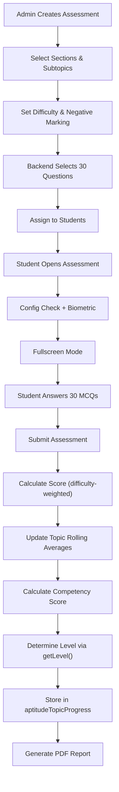

# Aptitude Assessment

> The Aptitude Assessment evaluates a student's **Quantitative Aptitude, Logical Reasoning, and Critical Reasoning** abilities using MCQ-based questions. Students are assigned an adaptive **proficiency level** (Beginner → Learner → Competent → Advanced) that evolves based on their performance.

---

## Overview

| Property | Value |
|---|---|
| **Assessment Type** | `Aptitude` |
| **Total Questions** | 30 MCQs |
| **Proficiency Levels** | Beginner, Learner, Competent, Advanced |
| **Difficulty Levels** | Easy, Medium, Hard |
| **Negative Marking** | Optional (configurable per assessment) |
| **Scoring Model** | Difficulty-weighted points |
| **Time Tracked** | Per-question time |

---

## Assessment Sections (3 Categories)

| Section (PROD `section_name`) | Default Questions | Subtopics (examples) |
|---------|------------------|----------------------|
| **Quantitative** *(named "Quantitative", **not** "Quantitative Aptitude")* | 12 | Number System, Time & Work, Time/Speed/Distance, Percentages, etc. |
| **Logical Reasoning** | 11 | Coding-Decoding, Puzzles, Seating Arrangement, Blood Relations, etc. |
| **Critical Reasoning** | 7 | Conclusions & Inferences, Statement & Assumptions, etc. |

Questions are distributed across subtopics based on **weights** defined in the `sub_sections` table.

**Current PROD sub-section weights** (aptitude `assessment_type_id` = `e8c2b601-0cbb-4e12-8d93-60f47b7d6e6b`):

| Section | Sub-topics (weight) |
|---------|----------------------|
| **Quantitative** (12) | Number System 5 · Time and Work 5 · Time, Speed & Distance 5 · Percentages 4 · Pipes and Cisterns 4 · Profit and Loss 4 · Ratio and Proportion 4 · Averages 3 · Permutations & Combinations 3 · Simple & Compound Interest 3 · Mixtures & Alligations 2 · Probability 2 |
| **Logical Reasoning** (11) | Coding-Decoding 5 · Puzzles 5 · Seating Arrangement 5 · Blood Relations 4 · Number/Letter Series 4 · Direction Sense 3 · Syllogisms 3 · Analogy 2 · Data Sufficiency 2 · Input-Output 2 · Odd One Out 2 |
| **Critical Reasoning** (7) | Conclusions & Inferences 5 · Statement & Assumptions 5 · Course of Action 4 · Statement & Arguments 4 · Cause & Effect 3 · Facts, Inferences & Judgements 2 · Paradox Questions 2 |

### Topic-level difficulty pinning — the "band" model (DEV + UAT; PROD pending)

> Supersedes weight-proportional distribution for set generation. **PROD still runs the legacy weight path** until this is promoted there.

Per the approved **Aptitude Question Blueprint**, each topic is pinned to one or more **difficulty bands** in `assessment.aptitude_topic_band_config` (`sub_section_id`, `difficulty`, `weight`, `buffer_target`, `is_active`). A topic in a band only ever supplies questions of that difficulty, so the easy/medium/hard split is now **exact per track** instead of shuffled globally.

- **Track split:** 40Q = Quant **14** / Logical **13** / Critical **13**; 30Q = **10 / 10 / 10**. (Was 17/15/8 and 13/11/6.)
- **Difficulty matrix** per (testLength × variant × track) lives in `aptitudeDistribution.js` (`APTITUDE_TRACK_MATRIX`); the 40Q-Medium cell equals the expert blueprint (Quant 4/7/3, Logical 4/7/2, Critical 4/6/3). Column totals still match the old 30/50/20 budget, so the level ladder is unchanged.
- **Selection:** `buildAptitudeBandSlots()` emits one slot per question (topic + pinned difficulty); `_selectAptitudeQuestionForSlot()` fetches at that exact difficulty (relaxes topic within the track under exhaustion, never difficulty). Mirrored in `student-node` `generateSingleStudentAssessmentSet` and `admin-node` `selectAptitudeQuestionsForAssessment`.
- **Fallback:** if the blueprint can't fill all slots for a set, the partial set is discarded and a full set is rebuilt from the legacy config — never an empty/short set (logs `[BANDS][FALLBACK]`).
- **Seating Arrangement** intentionally sits in **both** medium (linear) and hard (circular) bands. **Analogy** and **Data Sufficiency** are intentionally dropped (rows omitted; questions retained).
- Config panel `GET /assessment/getAptitudeConfig` reads the band table (falls back to the count table pre-seed).
- Migration: DB-Scripts `Aptitude Config Revamp/20260717T081421Z__aptitude_topic_band_config.sql`.

### Topic selection — admin picks the sub-topics (DEV + UAT 2026-08-05; PROD pending)

Both the **institute** and **corporate** create-assessment flows now expose the same topic picker (section cards → "Select Assessment Topics" modal). The institute flow previously showed a read-only *"Auto-configured for Institute"* panel and sent every sub-topic.

**The selection now binds.** Before this, both band selectors loaded their rows by `section_id` **only** — the chosen sub-topics were resolved, logged, then ignored, so corporate's picker had been a **no-op on DEV/UAT** ever since the band model shipped (it only ever narrowed *sections*). PROD was unaffected because the legacy weight path does honour subtopics.

- **Selection binds:** `selectAptitudeQuestionsForAssessment` narrows band rows to the selected `sub_section_id`s via `_fetchAptitudeBandRows()` (shared with the pre-flight, so the two can never disagree). Mirrored in `student-node` `generateSingleStudentAssessmentSet`.
- **Dropped tracks are re-homed:** `resolveAptitudeTrackCounts()` moves the question budget of a track that lost all its topics onto the tracks that remain, dealing the surplus from a **rotating start track per difficulty** — 30Q over two sections lands on an even **15/15**, one section takes all 30. The **easy/medium/hard totals are unchanged** in every case, so the level ladder and `getLevel()` thresholds still hold. With all three tracks active the matrix is returned untouched, so a default (all-topics) paper is bit-for-bit what it was.
- **Emptied cells:** a (track × difficulty) cell the selection emptied is filled from another topic **in the same track at the same difficulty**. Difficulty drives scoring and is never relaxed.
- **Non-selectable topics are hidden:** `GET /assessment/getAptitudeTopics` returns `selectable` per topic — band rows if the band table is seeded, else the legacy count config. A topic outside the blueprint can never win a slot, so the picker must not offer it. On DEV/UAT this hides **Pipes and Cisterns, Input-Output, Data Sufficiency, Analogy, Odd One Out** (25 of 30 selectable); on PROD (no band rows) nothing is hidden. Adding a band row makes a topic reappear — no code change.
- **Pre-flight:** `POST /assessment/aptitudeTopicAvailability` (`{aptitudeTypes, subtopics, difficultySettings}`) reports `canGenerate` plus per `(topic, difficulty)` `shortfalls`. The admin-react picker calls it whenever the selection or difficulty settles and blocks Save — otherwise a too-narrow selection silently trips the `[BANDS][FALLBACK]` path and serves a paper built from topics nobody picked.
- **Minimum 10 sub-topics**, ≥1 section — identical for institute and corporate, enforced in the picker AND server-side (`MIN_APTITUDE_TOPICS` in `aptitudeDistribution.js`) on **both** `assignAptitudeAssessment` and `assignAptitudeAssessmentAsync` (the queue path is the one that actually runs on DEV/UAT).
- **`assessment_sets.selected_sub_section_ids` (uuid[])** records the topics a paper was commissioned from. Regeneration used to re-derive the topic list from the *questions* in the source set and then repoint the assignment at the set it built — a 30-question paper cannot cover every selected topic, so the pool narrowed at every regeneration. Written by all four sync set-creation sites and by `app/queues/setGenerators/aptitudeSetGenerator.js`; carried forward onto the regenerated set. **Empty = not recorded** (pre-2026-08 sets), in which case readers keep the old section-wide behaviour — no backfill needed.
- **Scheduled assessments:** the selection applies to every run of the schedule **and to the diagnosis pair**, and is fixed for the schedule's life (`EditScheduleDrawer` edits dates/frequency/students only — never the assessment config). The picker shows an advisory that scores measured on different topic sets are not comparable with past attempts.
- Migration: DB-Scripts `Aptitude Topic Selection/20260805T092354Z__aptitude_selected_sub_section_ids.sql` (DEV + UAT applied, PROD pending).

#### The legacy path also had to be bound (fixed 2026-08-05, same day)

The first UAT paper built from an 11-topic selection still served **7 questions from de-selected topics**. Binding the band path was not enough, because **`isPegging` skips the band blueprint entirely** — and `isPegging` is `hasNewStudents`, so *any* assignment containing a candidate who has no student account yet (the common case for a fresh invite) runs the legacy path. Two compounding causes there:

1. **The distribution was short by construction.** `aptitude_topic_question_config` holds **absolute** per-topic counts calibrated for the *full* topic set, so a narrowed selection sums short — those 11 topics summed to **13 of 30**. `scaleAptitudeTopicDistribution()` (in `aptitudeDistribution.js`) now re-spreads the paper across the selected topics, dealing the deficit round-robin by weight. Topics the count config folds to **0** are offered as *growth candidates*, so a topic the admin explicitly picked is no longer silently absent — they stay at 0 (and drop out) whenever the config already fills the paper, which is why the **default all-topics paper is unchanged**.
2. **Every top-up path ignored the selection.** `EMERGENCY FALLBACK` and `LAST RESORT` selected from *every* topic in the three sections (`WHERE LOWER(s.section_name) IN (...)`), so the 17 unfilled questions arrived from arbitrary topics. Both are now bounded to the selected `sub_section_id`s — reusing a question from a chosen topic beats testing one the admin excluded. `_selectAptitudeQuestionForSlot`'s within-track relaxation (band path) is bounded the same way, via a new `allowedSubSectionIds` argument.

> **Pegging also ignores the configured difficulty.** With `isPegging` true the `difficulties` array is never built, so `targetDifficulty` is `undefined`, every per-topic query falls through to the *any difficulty* branch, and the paper's easy/medium/hard mix is whatever the topics happen to yield (the UAT paper came out 14/9/7 against a configured 18/9/3). Pre-existing and by design — pegging samples across difficulties to peg a new student's level — but it means **a new candidate's first paper does not honour the difficulty the admin chose**, one-time assessments included.

### Dynamic generation buffers (per topic × difficulty)

The aptitude generation cron (`admin-node/script/generateAptitudeAssessment.js`) previously topped every subtopic×difficulty to a hardcoded **6**. It now reads a per-cell **`buffer_target`** from `aptitude_topic_band_config` (band cells, default 6), and applies a small **insurance floor (2)** to non-band cells so a future revert still has stock. **Editable from Question Manager without a redeploy** — see `manage-cron.md` (Manage Buffers). API: `GET/PUT /questionManager/generationTargets` (QM-JWT gated, target cap 500). Migration: DB-Scripts `Aptitude Config Revamp/20260717T180734Z__aptitude_band_buffer_target.sql`.

---

## Scoring System

### Difficulty Points

| Difficulty | Points (correct) | Negative Marking (wrong) |
|-----------|------------------|---------------------------|
| Easy | +1 | −0.25 |
| Medium | +2 | −0.50 |
| Hard | +3 | −0.75 |

Negative marking is **optional** — controlled by the `isMinusSystem` flag set during assessment creation. Skipped questions receive 0 points.

### Difficulty Distribution (auto-generated per level)

Distribution depends on test length (30-Q / 45-min or 40-Q / 60-min). Mix: Easy 60/30/10, Medium 30/50/20, Hard 20/50/30. (`student-node/app/models/Assessment.js` ~line 3366.)

**30-question set:**

| Set difficulty | Easy | Medium | Hard |
|---------------|------|--------|------|
| Easy set | 18 | 9 | 3 |
| Medium set | 9 | 15 | 6 |
| Hard set | 6 | 15 | 9 |

**40-question set:**

| Set difficulty | Easy | Medium | Hard |
|---------------|------|--------|------|
| Easy set | 24 | 12 | 4 |
| Medium set | 12 | 20 | 8 |
| Hard set | 8 | 20 | 12 |

---

## Level Determination

Levels are determined by the `getLevel()` function using the **difficulty** of the assessment and the **competency score** (weighted topic average).

### Difficulty → Level Matrix

| Difficulty | Score Range | Assigned Level |
|-----------|------------|----------------|
| **Easy** | 0–79% | Beginner |
| **Easy** | 80–100% | Learner |
| **Medium** | 0–39% | Beginner |
| **Medium** | 40–69% | Learner |
| **Medium** | 70–89% | Competent |
| **Medium** | 90–100% | Competent (next test → Hard) |
| **Hard** | 0–39% | Beginner |
| **Hard** | 40–59% | Learner |
| **Hard** | 60–79% | Competent |
| **Hard** | 80–100% | Advanced |

> **Medium caps at Competent.** A Medium test can never assign **Advanced** — the 90–100% band stays **Competent** but routes the student's *next* test to **Hard**, so Advanced is reachable only by scoring 80–100% on a Hard test. (`difficultyMapping` in `student-node/app/config/newAptitudeLevel.js`.)

> **Important:** For ongoing assessments (post-diagnosis), `getNewAssessmentLevel()` is used instead — it **prevents level downgrades**. Students can only maintain or improve their assessment level.

### Level → Difficulty Mapping (Adaptive)

When a student takes a new assessment, their level determines the base difficulty:

| Student Level | Assessment Difficulty |
|---------------|----------------------|
| Beginner | Easy |
| Learner | Medium |
| Competent | Medium |
| Advanced | Hard |

> **One-time assessments are excluded from adaptive difficulty.** In `getAptitudeAssessmentQuestions` (`student-node/app/models/Assessment.js`), a student with **2+ `progression_history` entries** has the assigned difficulty overwritten from their history, and `generateSingleStudentAssessmentSet()` regenerates their set at that difficulty (repointing `assessment_assigned_students.assessment_set_id`). This is skipped when `assessment_institute_map.is_one_time = true` — a one-time paper carries no progression in or out, so it serves **exactly the set/difficulty it was assigned**.
>
> Without this gate, students on the *same* one-time assessment sat different papers: only those with no progression history got the configured difficulty, while everyone else was silently downgraded to Easy/Medium. Because scoring is weight-based over whichever topics were selected, the papers were not even out of the same total, making the scores non-comparable. Fixed 2026-07-16 (`fix(assessment): exclude one-time assessments from progression-based selection`).
>
> Note the regeneration path derives its topic list from the **source set** (`uniqueSubtopics` is built from the original set's questions), not from the global `aptitude_topic_question_config`. Removing a subsection from an assigned set therefore propagates to any set regenerated from it.

### ~~Difficulty Multipliers~~ (Removed)

Previously, difficulty multipliers (Easy 0.85×, Medium 1.15×, Hard 1.40×) were applied to topic rolling averages via `calculateWeightedPercentage()`. These were **removed** because `getLevel()` already uses difficulty-specific thresholds — applying multipliers on top double-counted difficulty, causing inconsistent level assignments.

Rolling averages now use raw percentages (gained/total × 100). The difficulty-specific thresholds in `getLevel()` handle difficulty adjustment.

---

## End-to-End Flow

---

## File Reference

### 1. Assessment Creation (Admin)

#### Frontend — `AssessmentSelect.js`
**Path:** `admin-react/src/modules/Assessment/Partials/CreateAssessment/AssessmentSelect.js`

- Admin selects **assessment type** = `Aptitude`
- Configures: name, dates, sections (Quantitative/Logical/Critical), subtopics, difficulty, negative marking, proctoring
- Supports **one-time** and **scheduled** distribution
- `renderAptitudeTopics()` hoists the section cards, `TopicSelectionModal` and the selection summary **above** the institute/corporate branch, so both flows share one picker; only the surrounding config differs (institute is fixed at 45 min / 30 Q, corporate chooses a duration). See *Topic selection* above.
- Two sites used to overwrite the admin's picks with every topic — the save path and `handleDifficultyLevelChange` (so changing difficulty **after** picking topics silently discarded them). Both now fill in only what the admin did not choose, so an untouched form still defaults to every section and topic.

#### Backend — `Assessment.js` → `assignAptitudeAssessment()`
**Path:** `admin-node/app/models/Assessment.js` (line ~6338)

**Key steps:**
1. Validates input: entity, assessment type, aptitude types, subtopics
2. Fetches students via `getAssessmentAssignedParticipants()`
3. Classifies students: new, existing first-time aptitude, returning
4. Calls `selectAptitudeQuestionsForAssessment()` to select 30 questions
5. Creates assessment records (institute/corporate map, assessment set, assigned students)
6. Creates students in the system if they don't exist (auto-registration)

#### Question Selection — `selectAptitudeQuestionsForAssessment()`
**Path:** `admin-node/app/models/Assessment.js` (line ~7153)

**Algorithm:**
1. Maps aptitude types to `sections` table
2. Maps subtopics to `sub_sections` table (with weights)
3. Distributes 30 questions across sections based on fixed allocation (12/11/7)
4. Within each section, distributes by subtopic weight
5. For each subtopic, selects questions by the configured difficulty distribution (easy/medium/hard)
6. Avoids previously seen questions per student (`excludeQuestionIds`)
7. Randomizes selection within each pool

---

### 2. Student-Facing Frontend

**Path:** `Assessment-React/src/modules/Assessments/Partials/aptitudeassmt/`

| File | Purpose |
|------|--------|
| `index.js` | Entry point — shows assessment name, deadline, **ConfigCheck** (camera/mic), then **BiometricCheck**, Start button |
| `instruction.js` | Instructions page — general aptitude assessment instructions, fullscreen request |
| `assessment.js` | **Main assessment UI** — full-screen MCQ interface with collapsible sidebar question navigator, per-question timer, answer tracking, violation detection |
| `assessment-solution.js` | Post-assessment solution review — shows correct answers and explanations |
| `completion.js` | Results page — overall score card, difficulty analysis, per-section & per-topic breakdown, retry support with auto-polling |
| `styles.js` | Shared styled-components |

**Key behaviors in `assessment.js`:**
- **Sidebar navigation** — collapsible question list with status indicators (answered, skipped, current)
- **Per-question timing** — tracks `timeTaken` for each question
- **Anti-cheat** — fullscreen enforcement, tab-switch detection (max 3 warnings → auto-submit)
- **Question states** — answered (green), skipped (gray), current (blue), unanswered (default)
- **Markdown support** — questions can include formatted math/code via markdown rendering

**Key behaviors in `completion.js`:**
- **Auto-polling** — polls server for scores with exponential backoff (max 5 retries every few seconds)
- **Score breakdown** — shows correct/wrong/unanswered counts, gained vs total marks
- **Difficulty analysis** — separate breakdown by Easy/Medium/Hard
- **Topic analysis** — per-subtopic performance with percentage bars
- **Solution review** — navigates to `assessment-solution.js` for detailed answer review

---

### 3. Question Delivery (Student Backend)

#### `getAptitudeAssessmentQuestions()`
**Path:** `student-node/app/models/Assessment.js` (line ~3294)

**Key logic:**
1. Receives `assessment_set_id` and `assessment_assigned_id`
2. **Level-based difficulty adaptation** for institute assessments (not practice):
   - Looks up student's `AssessmentLevelOfStudent` from `aptitudeTopicProgress`
   - If level maps to a different difficulty than the assigned set → generates a **new question set** via `generateSingleStudentAssessmentSet()`
3. Fetches questions grouped by section
4. Returns `isMinusSystem` flag along with question data

#### `generateSingleStudentAssessmentSet()`
**Path:** `student-node/app/models/Assessment.js` (line ~2907)

Dynamically generates a new 30-question set at the required difficulty:
- Uses same section distribution (12/11/7)
- Applies difficulty configs per level
- Creates new `assessmentSet` and `assessmentQuestionMap` records
- Updates the student's `assessmentAssignedStudent` record to point to the new set

**Concurrency guard (set-regeneration race fix).** This runs on the re-callable
question-fetch path, so a duplicate/overlapping fetch (double-click Start, reload,
React re-invoke) could previously regenerate **twice** — both calls read the same
seed set and each created its own random set, with last-write-wins on
`assessment_set_id`. The student then answered set #1 while the assignment pointed
at set #2 (different random questions, 0 overlap). Because `student_answers` is keyed
only by `question_id` (no `set_id`), scoring read the wrong set's questions and
counted the answers as unattempted → **0 / under-counted marks** (e.g. Christ Univ:
21 fully-zeroed + partial cases like 29 answered / 3 counted). Now hardened:
- **R1:** the create+update runs under a per-attempt advisory lock
  `pg_advisory_xact_lock(42, hashtext(assessment_assigned_id))`; after acquiring it the
  code re-reads state and **reuses** the existing set if the required-difficulty set
  already exists, or the student has `submitted`, or any `student_answers` exist.
  Result: exactly one set per attempt.
  - ⚠️ **Gotcha:** `pg_advisory_xact_lock()` returns SQL type `void`. It **must** be
    invoked with `prisma.$executeRaw` (which does not deserialize a result set), **not**
    `prisma.$queryRaw`. With `$queryRaw`, Prisma 4.16.2 throws `P2010 — Failed to
    deserialize column of type 'void'`, which is the **first** statement in the
    generation transaction, so it aborts before any set is created. The whole
    `getAssessmentQuestions` call returns an error, the assignment never flips to
    `INPROGRESS`, and the student is stuck on **"Preparing your assessment…"**. This
    shipped broken on `release-v1.33-hotfix-1` (image `2026-06-08…`) and was fixed
    `2026-06-14` by switching `$queryRaw` → `$executeRaw` on that line.
- **R2:** `getAptitudeAssessmentQuestions()` skips regeneration entirely once answers
  exist for the attempt.
- **Frontend:** `Assessment-React` de-duplicates `fetchAssessmentQuestions` per
  `assessment_assigned_id` (in-flight request reuse) so duplicate fetches collapse to one.

**Performance hardening (2026-06-14) — stop the regenerate-storm DB saturation.**
A buggy/looping client (e.g. a bulk/load-test account polling `getAssessmentQuestions`
hundreds of times) used to make *every* call re-run the full per-question selection
(~30 `ORDER BY RANDOM() LIMIT 1` queries, each with a correlated
`NOT IN (… LOWER(primary_email) …)` scan over `assessment_assigned_students`), pinning
all DB connections and making save-answer / start / submit take 20–55s platform-wide.
The regen also couldn't commit under that load (`Unable to start a transaction`), so the
set difficulty never updated and the loop never ended. Three fixes:
- **Early idempotency short-circuit:** `generateSingleStudentAssessmentSet()` now re-reads
  the assignment FIRST (before any selection) and returns immediately — reusing the set —
  if the set already matches the required difficulty, the student has answers, or it's
  submitted. Repeat calls become a cheap two-PK-lookup no-op, so a looping client can no
  longer trigger repeated selection. (The in-tx advisory lock still guards the first-time
  concurrent-create race.)
- **Removed the per-question `NOT IN (… LOWER(primary_email) …)` subquery.** The student's
  already-seen questions are computed once (`excludeQuestionIds`) and excluded via the
  `!= ALL($3)` array — the prior code computed that set once *and ignored it*, then
  re-derived it on each of the 30 picks.
- **Indexes** (DB-Scripts `Aptitude Set Regeneration Race Fix/003`): `section_question_map(sub_section_id)`,
  `assessment_question_map(question_id)`, `assessment_assigned_students(LOWER(primary_email))`.
  ⚠️ The `LOWER(primary_email)` functional index existed on DEV (`idx_aas_email_lower_practice`)
  but was **missing on PROD** — schema drift that made PROD's selection far slower than DEV.
  Apply with `CREATE INDEX CONCURRENTLY` (outside a transaction).

---

### 4. Score Calculation

#### `calculateAptitudeScore()`
**Path:** `student-node/app/models/Assessment.js` (line ~11212)

**Processes each question:**
1. Looks up section/subsection mapping
2. Calculates difficulty-weighted points (+1/+2/+3)
3. Applies negative marking if enabled (−0.25/−0.50/−0.75)
4. Builds comprehensive `statistics` object with:
   - **Summary**: total questions, attempted, right, wrong, unattempted, marks by difficulty
   - **Categories** (sections): per-section totals with difficulty breakdown
   - **Topics** (subtopics): per-topic totals with difficulty breakdown and time spent

Stores result in `aptitudeScores` table via **upsert keyed on the unique
`assessment_assigned_id`** — exactly one score row per assignment. (The old
find-then-create "retake" branch could write a second row, which is why duplicate
aptitude_scores rows accumulated; cleaned up + a `UNIQUE(assessment_assigned_id)`
index now backstops it — DB-Scripts `Aptitude Set Regeneration Race Fix/002`. The
unique index must exist before the upsert code deploys, or `INSERT .. ON CONFLICT` errors.)

**Integrity guard (R4).** Before scoring, it checks that the student's real
(non-SKIPPED) answers are all contained in the assigned set. If the assigned set
contains fewer of them than another set does (set-regeneration race — disjoint OR
partial), it auto-resolves: re-points `assessment_set_id` to the set whose
`assessment_question_map` actually matches the answers (must be *strictly better* and
contain *all* of them) and re-scores. If fully disjoint and no matching set is found
it returns `integrity_mismatch` (never persists a false 0); partial-with-no-better-set
scores on the overlap and warns. This both prevents new bad scores and self-heals on
any re-score.

**Backfill endpoint.** `POST /students/assessments/aptitude/backfill-set-mismatch`
(`aptitudeBackfillHandler.backfillAptitudeSetMismatch`) recovers already-affected
assessments. Detects victims via `distinct_real_answers > scored attempted`, finds the
best-matching set, and (when `dryRun:false`) re-points + deletes the old score +
recalculates. `dryRun:true` (default) previews only; non-resolvable cases (current set
already complete) are returned as `needs_review` and left untouched. Body:
`{ dryRun?:bool=true, assessment_assigned_ids?:string[], limit?:int=200, includeRescore?:bool=false }`.
With `includeRescore:true`, rows whose set already contains all answers but whose stored score
under-counted (the duplicate-answer bug below) are re-scored in place (no re-point) → status `rescored`.

**Duplicate-answer dedup.** `student_answers` can hold multiple rows per question (re-answer /
re-submit). Scoring previously used `.find()` (first match), which could pick a `SKIPPED` duplicate and
count a genuinely-answered question as unattempted (off-by-1..3 under-count). Scoring now builds a
per-question map preferring a non-`SKIPPED` (and latest `submittedAt`) row before counting.

**Index:** `assessment.student_answers(assessment_assigned_id)` backs the per-attempt
answer lookups (scoring, guard, backfill) — see DB-Scripts `Aptitude Set Regeneration
Race Fix/001`.

**Transaction model:** Score calculation and `updateAptitudeProgression()` run inside a single Prisma `$transaction` (timeout: 30s). This is critical because aptitude scores are calculated on-the-fly after submission (not via cron), so there is **no retry mechanism** — if progression fails, the student's level won't update. The transaction ensures atomicity: either both scoring and progression succeed, or neither does.

> **Key difference from Communication:** Communication progression is `await`ed but outside a transaction. If it fails, the cron job retries the entire calculation. Aptitude has no such safety net, hence the transactional approach.

---

### 5. Level Update & Progression

#### `updateAptitudeProgression()`
**Path:** `student-node/app/models/Assessment.js` (line ~11080)

**The progression system uses `diagnosis_number` to track phase:**

| `diagnosis_number` | Phase | Description |
|---------------------|-------|-------------|
| 1 | Diagnosis #1 | First assessment — initial topic data, no level yet |
| 2 | Diagnosis #2 | Second assessment — pair complete, first level assigned |
| 3 | Post-diagnosis | All subsequent assessments |

**Phase details:**

1. **Diagnosis #1** (`diagnosis_number = 1`):
   - Creates `aptitudeTopicProgress` record with initial topic data from this assessment
   - No level assigned yet — stored as null
   - Creates ProgressionHistory with `isSecondInPair = false`

2. **Diagnosis #2** (`diagnosis_number = 2`):
   - Calculates rolling average per topic (last 2 attempts)
   - Calculates weighted **competency score** across all topics
   - Determines level via `getLevel(difficulty, competencyScore)`
   - Calculates **Aptitude NPS**: `((levelIndex × 100) + competencyScore) / 4`
   - Sets `AssessmentLevelOfStudent`, `LevelOfStudent`, and `MaxLevelOfStudent`
   - Backfills ProgressionHistory for **both** assessments (A1 and A2)

3. **Ongoing assessments** (`diagnosis_number = 3`):
   - **Assessment mode**: Uses `getNewAssessmentLevel()` — only allows upgrades (no-downgrade)
   - **Practice mode**: Uses `getLevel(assessmentDifficulty, competencyScore)` with the actual assessment difficulty — allows level changes up/down, tracks `MaxLevelOfStudent`
   - Creates ProgressionHistory with `isSecondInPair = true` (every post-diagnosis assessment completes a "pair" immediately using topic rolling averages)

**Key difference from Communication:** Aptitude uses **topic-level rolling averages** (pairs of 2 topic scores) rather than assessment-level pairs. Every post-diagnosis assessment immediately produces a level update because the rolling averages already incorporate the pair logic at the topic level.

#### Topic Rolling Average
- Keeps **last 2 scores** per topic
- Calculates raw percentage for each (gained_marks / total_marks × 100), averages them
- No difficulty multiplier applied — `getLevel()` handles difficulty via its threshold table
- Status thresholds: < 50% = weak, 50-74% = moderate, ≥ 75% = strong

#### Competency Score
- Weighted average of all topic rolling averages
- Weights come from `sub_sections.weight` table
- Formula: `Σ(topic_rolling_avg × topic_weight) / Σ(topic_weight) × 100`

**ProgressionHistory fields stored (aptitude):**

| Field | Description |
|-------|-------------|
| `assessmentAptitudeLevel` | Confirmed aptitude level |
| `assessmentAptitudeProgressScore` | NPS score |
| `aptitudeDifficulty` | Assessment difficulty (Easy/Medium/Hard) |
| `aptitudeLevelAtTime` | Student's level at the time |
| `aptitudeCompetencyScore` | Weighted competency score |
| `aptitudeFinalScore` | Individual assessment score |
| `isSecondInPair` | `true` for A2 (pair complete) |
| `isPractice` | Practice vs assessment mode |

#### `fetchAptitudeProgression()`
**Path:** `student-node/app/models/Assessment.js` (line ~276)

Replays the entire assessment history to compute progression for the **detail view** (individual student progression page):
- Fetches all submitted aptitude assessments (chronologically)
- Simulates topic-by-topic rolling averages step by step
- Compares target assessment vs previous to show deltas

> **Note:** This method is used for the individual student progression detail view only. The **dashboard list views** (TPO student lists, pie charts) read aptitude level and NPS directly from `ProgressionHistory` records for consistency and performance. See "Dashboard Data Sources" below.

---

### 6. Cron Job

Same cron job as Communication: `student-node/script/calculatePendingAssessmentCron.js`

For aptitude, `calculateAssessmentScore()` routes to `calculateAptitudeScore()` when `assessmentType === "aptitude"`.

---

### 7. PDF Report

#### `generateAptitudePDFReport()`
**Path:** `student-node/app/models/Assessment.js` (line ~7827)

- Renders HTML template via Handlebars
- Converts to PDF using Puppeteer
- Report includes:
  - Student info and assessment details
  - Overall score and proficiency level
  - Difficulty-wise breakdown (Easy/Medium/Hard)
  - Section-wise performance
  - Topic-wise detailed analysis
  - Progression comparison (if previous assessment exists)

**Proficiency-level visibility on the report (who sees the bar).** As of
2026-06-29 the "Proficiency Level" bar renders **only for institute reports**:

| Report entity | One-time? | Proficiency bar | Source |
|---|---|---|---|
| **Corporate** | — | **hidden** | — |
| **Institute** | yes (one-time) | shown | `directProficiencyLevel` = `getLevel(setDifficulty, overallPercentage)` — from this test's difficulty + score |
| **Institute** | no | shown (if ≥2 assessments) | `progressionAptitudeLevel` — the adaptive progression level, as usual |

`directProficiencyLevel` is computed in `generateAptitudePDFReport()` only when
`!isCorporate && isOneTime`. `isCorporate = assessmentCorporateMapId != null`;
`isOneTime = assessmentInstituteMap.isOneTime` (corporate has no institute map, so
`isOneTime` is institute-only). The template (`public/aptitudeReport.html`)
resolves the displayed level in priority order: `directAptitudeLevel` (institute
one-time) → `progressionAptitudeLevel` (institute, ≥2 assessments) → local
fallback. Corporate hits none of these → no bar. Backend→display map:
`Beginner→Beginner, Learner→Intermediate, Competent→Upper Intermediate,
Advanced→Advanced`. (DEV `Development` / UAT `UAT` — commit `76dd4e8b`.)

> **Note:** Corporate/one-time aptitude has no progression system (no
> `progression_history` / `aptitude_topic_progress` rows), which is why the
> institute-one-time badge is computed directly from difficulty + score rather
> than read from stored progression.

> ⚠️ **Bug fixed 2026-06-29 — report always scored on the Medium scale.**
> `generateAptitudePDFReport()` built its `assessmentSet` Prisma `select` WITHOUT
> `difficulty`, then read `assessmentInfo.assessmentSet?.difficulty || 'medium'`.
> Because `difficulty` was never fetched it was always `undefined`, so **every**
> aptitude report defaulted the difficulty to `'medium'`. An **Easy** test scored
> 78% therefore showed **"Upper Intermediate"** (medium band 70–89% = Competent)
> instead of the correct **Beginner** (easy band 0–79%). Real example: corporate
> candidate `tanushkadixit1@gmail.com`, easy set, 35/45 = 78% → reported Upper
> Intermediate. Numeric score / section / topic / difficulty-breakdown tables were
> always correct — only the proficiency badge was mis-scaled. **Fix:** add
> `difficulty: true` to the `assessmentSet` select so the real set difficulty flows
> into `getLevel()`. (DEV `Development`, UAT `UAT` — commit `9bca9035`.)

---

### 8. Backfill API

#### `POST /assessment/backfill-aptitude-progression`
**Handler:** `assessmentHandler.backfillAptitudeProgressionHistory`
**Method:** `Assessment.backfillAptitudeProgression(batchSize)`

Recalculates all aptitude progression history for every student:
1. Finds all students with calculated aptitude assessments
2. For each student, fetches all assessments ordered by `submittedAt`
3. Separates into practice vs assessment chains
4. Replays each chain: rebuilds topicInfo, rolling averages, competency scores, levels, and NPS
5. Deletes old `ProgressionHistory` aptitude records and creates new ones
6. Updates `AptitudeTopicProgress` with final state

**Request body:** `{ "batchSize": 50 }` (optional, default 50)

Use this after fixing scoring/level bugs to recalculate all historical data.

---

### 9. Dashboard Data Sources (TpoDashBoard.js)

| Data | Source | Notes |
|------|--------|-------|
| **Aptitude NPS** | `ProgressionHistory.assessmentAptitudeProgressScore` | Scoped by `assessmentAssignedId` for per-assessment views |
| **Aptitude Level** | `ProgressionHistory.assessmentAptitudeLevel` | A2 record preferred, fallback to A1. Same source as NPS for consistency |
| **Assigned Difficulty** | `assessmentSet.difficulty` | From the specific assessment being viewed |
| **Pie Chart (Aptitude)** | `ProgressionHistory.assessmentAptitudeLevel` | Batch query per assessment, scoped by assignedId |

> **Why not `fetchAptitudeProgression` for dashboard?** That method replays history with its own independent calculation which can diverge from the stored NPS. Reading both level and NPS from the same `ProgressionHistory` record guarantees consistency.

#### Progression Query Scoping

Per-assessment views (`getStudentListForAssessment`) scope progression queries by `assessmentAssignedId` — ensuring the level shown is for that specific assessment, not the student's latest level. Total candidate views (`getStudentListForTpoDashboard`) use latest-by-email.

---

## Database Tables (Key)

| Table | Purpose |
|-------|--------|
| `sections` | Top-level categories (Quantitative Aptitude, Logical Reasoning, Critical Reasoning) |
| `sub_sections` | Subtopics within sections (with `weight` for distribution) |
| `questions` | Question bank with `difficulty` (easy/medium/hard) and `explanation` |
| `section_question_map` | Maps questions to sections/subsections |
| `assessment_set` | Generated question pack with `difficulty` level |
| `assessment_question_map` | Maps questions to assessment sets |
| `assessment_assigned_students` | Per-student assignment (tracks `isMinusSystem`, `totalTakenTime`) |
| `student_answers` | Individual question responses with `answerText` and `timeTaken` |
| `aptitude_scores` | Aggregated scores with full `statistics` JSON (sections, topics, difficulty breakdown) |
| `aptitude_topic_progress` | Per-student adaptive state: `AssessmentLevelOfStudent`, `LevelOfStudent`, `MaxLevelOfStudent`, `topicInfo` |
| `progression_history` | Historical level/NPS snapshots per assessment |

---

PDF report template: student-node\public\aptitudeReport.html

## Key Concepts

- **Diagnosis Phase** — First 2 assessments establish the student's baseline level. No level is assigned after just 1 assessment.
- **Adaptive Difficulty** — After diagnosis, the system auto-selects question difficulty based on the student's current level.
- **No Downgrades** — In assessment mode (post-diagnosis), `getNewAssessmentLevel()` prevents the student from dropping levels. Practice mode allows free level movement.
- **Rolling Average** — Per-topic proficiency uses only the last 2 assessment scores (raw percentages, no difficulty multiplier), providing a responsive measure of current ability.
- **Competency Score** — The master metric: a weighted average of all topic rolling averages (using `sub_sections.weight`), used to determine the overall level.
- **NPS (Normalized Progress Score)** — Formula: `((levelIndex × 100) + competencyScore) / 4`. Ranges: Beginner 0–25, Learner 25–50, Competent 50–75, Advanced 75–100. Level and NPS are always stored together in `ProgressionHistory` for consistency.
- **Topic Status** — Each subtopic gets a status: weak (< 50%), moderate (50–74%), strong (≥ 75%) based on rolling average.
- **Set Rotation** — Question sets exclude previously seen questions to prevent repetition.
