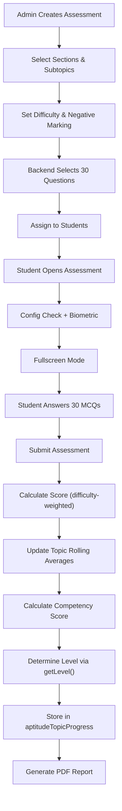

# Aptitude Assessment

> The Aptitude Assessment evaluates a student's **Quantitative Aptitude, Logical Reasoning, and Critical Reasoning** abilities using MCQ-based questions. Students are assigned an adaptive **proficiency level** (Beginner → Learner → Competent → Advanced) that evolves based on their performance.

---

## Overview

| Property | Value |
|---|---|
| **Assessment Type** | `Aptitude` |
| **Total Questions** | 30 MCQs |
| **Proficiency Levels** | Beginner, Learner, Competent, Advanced |
| **Difficulty Levels** | Easy, Medium, Hard |
| **Negative Marking** | Optional (configurable per assessment) |
| **Scoring Model** | Difficulty-weighted points |
| **Time Tracked** | Per-question time |

---

## Assessment Sections (3 Categories)

| Section | Default Questions | Subtopics (examples) |
|---------|------------------|----------------------|
| **Quantitative Aptitude** | 12 | Percentages, Profit & Loss, Time & Work, Averages, etc. |
| **Logical Reasoning** | 11 | Series, Coding-Decoding, Syllogisms, Blood Relations, etc. |
| **Critical Reasoning** | 7 | Analogies, Statement Analysis, etc. |

Questions are distributed across subtopics based on **weights** defined in the `sub_sections` table.

---

## Scoring System

### Difficulty Points

| Difficulty | Points (correct) | Negative Marking (wrong) |
|-----------|------------------|--------------------------||
| Easy | +1 | −0.25 |
| Medium | +2 | −0.50 |
| Hard | +3 | −0.75 |

Negative marking is **optional** — controlled by the `isMinusSystem` flag set during assessment creation. Skipped questions receive 0 points.

### Difficulty Distribution (auto-generated per level)

| Student Level | Easy | Medium | Hard |
|---------------|------|--------|------|
| Easy set | 15 | 8 | 7 |
| Medium set | 8 | 15 | 7 |
| Hard set | 10 | 10 | 10 |

---

## Level Determination

Levels are determined by the `getLevel()` function using the **difficulty** of the assessment and the **competency score** (weighted topic average).

### Difficulty → Level Matrix

| Difficulty | Score Range | Assigned Level |
|-----------|------------|----------------|
| **Easy** | 0–79% | Beginner |
| **Easy** | 80–100% | Learner |
| **Medium** | 0–39% | Beginner |
| **Medium** | 40–69% | Learner |
| **Medium** | 70–89% | Competent |
| **Medium** | 90–100% | Advanced |
| **Hard** | 0–39% | Beginner |
| **Hard** | 40–59% | Learner |
| **Hard** | 60–79% | Competent |
| **Hard** | 80–100% | Advanced |

> **Important:** For ongoing assessments (post-diagnosis), `getNewAssessmentLevel()` is used instead — it **prevents level downgrades**. Students can only maintain or improve their assessment level.

### Level → Difficulty Mapping (Adaptive)

When a student takes a new assessment, their level determines the base difficulty:

| Student Level | Assessment Difficulty |
|---------------|----------------------|
| Beginner | Easy |
| Learner | Medium |
| Competent | Medium |
| Advanced | Hard |

### Difficulty Multipliers (for mixed-difficulty rolling averages)

| Difficulty | Multiplier |
|-----------|----------|
| Easy | 0.85× |
| Medium | 1.15× |
| Hard | 1.40× |

---

## End-to-End Flow

---

## File Reference

### 1. Assessment Creation (Admin)

#### Frontend — `AssessmentSelect.js`
**Path:** `admin-react/src/modules/Assessment/Partials/CreateAssessment/AssessmentSelect.js`

- Admin selects **assessment type** = `Aptitude`
- Configures: name, dates, sections (Quantitative/Logical/Critical), subtopics, difficulty, negative marking, proctoring
- Supports **one-time** and **scheduled** distribution

#### Backend — `Assessment.js` → `assignAptitudeAssessment()`
**Path:** `admin-node/app/models/Assessment.js` (line ~6338)

**Key steps:**
1. Validates input: entity, assessment type, aptitude types, subtopics
2. Fetches students via `getAssessmentAssignedParticipants()`
3. Classifies students: new, existing first-time aptitude, returning
4. Calls `selectAptitudeQuestionsForAssessment()` to select 30 questions
5. Creates assessment records (institute/corporate map, assessment set, assigned students)
6. Creates students in the system if they don't exist (auto-registration)

#### Question Selection — `selectAptitudeQuestionsForAssessment()`
**Path:** `admin-node/app/models/Assessment.js` (line ~7153)

**Algorithm:**
1. Maps aptitude types to `sections` table
2. Maps subtopics to `sub_sections` table (with weights)
3. Distributes 30 questions across sections based on fixed allocation (12/11/7)
4. Within each section, distributes by subtopic weight
5. For each subtopic, selects questions by the configured difficulty distribution (easy/medium/hard)
6. Avoids previously seen questions per student (`excludeQuestionIds`)
7. Randomizes selection within each pool

---

### 2. Student-Facing Frontend

**Path:** `Assessment-React/src/modules/Assessments/Partials/aptitudeassmt/`

| File | Purpose |
|------|--------|
| `index.js` | Entry point — shows assessment name, deadline, **ConfigCheck** (camera/mic), then **BiometricCheck**, Start button |
| `instruction.js` | Instructions page — general aptitude assessment instructions, fullscreen request |
| `assessment.js` | **Main assessment UI** — full-screen MCQ interface with collapsible sidebar question navigator, per-question timer, answer tracking, violation detection |
| `assessment-solution.js` | Post-assessment solution review — shows correct answers and explanations |
| `completion.js` | Results page — overall score card, difficulty analysis, per-section & per-topic breakdown, retry support with auto-polling |
| `styles.js` | Shared styled-components |

**Key behaviors in `assessment.js`:**
- **Sidebar navigation** — collapsible question list with status indicators (answered, skipped, current)
- **Per-question timing** — tracks `timeTaken` for each question
- **Anti-cheat** — fullscreen enforcement, tab-switch detection (max 3 warnings → auto-submit)
- **Question states** — answered (green), skipped (gray), current (blue), unanswered (default)
- **Markdown support** — questions can include formatted math/code via markdown rendering

**Key behaviors in `completion.js`:**
- **Auto-polling** — polls server for scores with exponential backoff (max 5 retries every few seconds)
- **Score breakdown** — shows correct/wrong/unanswered counts, gained vs total marks
- **Difficulty analysis** — separate breakdown by Easy/Medium/Hard
- **Topic analysis** — per-subtopic performance with percentage bars
- **Solution review** — navigates to `assessment-solution.js` for detailed answer review

---

### 3. Question Delivery (Student Backend)

#### `getAptitudeAssessmentQuestions()`
**Path:** `student-node/app/models/Assessment.js` (line ~3294)

**Key logic:**
1. Receives `assessment_set_id` and `assessment_assigned_id`
2. **Level-based difficulty adaptation** for institute assessments (not practice):
   - Looks up student's `AssessmentLevelOfStudent` from `aptitudeTopicProgress`
   - If level maps to a different difficulty than the assigned set → generates a **new question set** via `generateSingleStudentAssessmentSet()`
3. Fetches questions grouped by section
4. Returns `isMinusSystem` flag along with question data

#### `generateSingleStudentAssessmentSet()`
**Path:** `student-node/app/models/Assessment.js` (line ~2907)

Dynamically generates a new 30-question set at the required difficulty:
- Uses same section distribution (12/11/7)
- Applies difficulty configs per level
- Creates new `assessmentSet` and `assessmentQuestionMap` records
- Updates the student's `assessmentAssignedStudent` record to point to the new set

---

### 4. Score Calculation

#### `calculateAptitudeScore()`
**Path:** `student-node/app/models/Assessment.js` (line ~11212)

**Processes each question:**
1. Looks up section/subsection mapping
2. Calculates difficulty-weighted points (+1/+2/+3)
3. Applies negative marking if enabled (−0.25/−0.50/−0.75)
4. Builds comprehensive `statistics` object with:
   - **Summary**: total questions, attempted, right, wrong, unattempted, marks by difficulty
   - **Categories** (sections): per-section totals with difficulty breakdown
   - **Topics** (subtopics): per-topic totals with difficulty breakdown and time spent

Stores result in `aptitudeScores` table.

---

### 5. Level Update & Progression

#### `updateAptitudeProgression()`
**Path:** `student-node/app/models/Assessment.js` (line ~10900)

**The progression system has three phases:**

1. **Diagnosis #1** (first assessment):
   - Creates `aptitudeTopicProgress` record with initial topic data
   - No level assigned yet

2. **Diagnosis #2** (second assessment):
   - Calculates rolling average per topic (last 2 attempts)
   - Calculates weighted **competency score** across all topics
   - Determines level via `getLevel(difficulty, competencyScore)`
   - Calculates **Aptitude NPS** (net promoter score)
   - Sets `AssessmentLevelOfStudent`, `LevelOfStudent`, and `MaxLevelOfStudent`
   - Backfills progression history for both assessments

3. **Ongoing assessments** (3rd+):
   - **Assessment mode**: Uses `getNewAssessmentLevel()` (prevents downgrades)
   - **Practice mode**: Uses `getLevel()` (allows level changes up/down), tracks `MaxLevelOfStudent`

#### Topic Rolling Average
- Keeps **last 2 scores** per topic
- Calculates percentage for each, averages them
- Applies difficulty multipliers for mixed-difficulty comparisons
- Status thresholds: < 50% = weak, 50-74% = moderate, ≥ 75% = strong

#### Competency Score
- Weighted average of all topic rolling averages
- Weights come from `sub_sections.weight` table
- Formula: `Σ(topic_rolling_avg × topic_weight) / Σ(topic_weight) × 100`

#### `fetchAptitudeProgression()`
**Path:** `student-node/app/models/Assessment.js` (line ~276)

Replays the entire assessment history to compute progression:
- Fetches all submitted aptitude assessments (chronologically)
- Simulates topic-by-topic rolling averages step by step
- Compares target assessment vs previous to show deltas

---

### 6. Cron Job

Same cron job as Communication: `student-node/script/calculatePendingAssessmentCron.js`

For aptitude, `calculateAssessmentScore()` routes to `calculateAptitudeScore()` when `assessmentType === "aptitude"`.

---

### 7. PDF Report

#### `generateAptitudePDFReport()`
**Path:** `student-node/app/models/Assessment.js` (line ~7827)

- Renders HTML template via Handlebars
- Converts to PDF using Puppeteer
- Report includes:
  - Student info and assessment details
  - Overall score and proficiency level
  - Difficulty-wise breakdown (Easy/Medium/Hard)
  - Section-wise performance
  - Topic-wise detailed analysis
  - Progression comparison (if previous assessment exists)

---

## Database Tables (Key)

| Table | Purpose |
|-------|--------|
| `sections` | Top-level categories (Quantitative Aptitude, Logical Reasoning, Critical Reasoning) |
| `sub_sections` | Subtopics within sections (with `weight` for distribution) |
| `questions` | Question bank with `difficulty` (easy/medium/hard) and `explanation` |
| `section_question_map` | Maps questions to sections/subsections |
| `assessment_set` | Generated question pack with `difficulty` level |
| `assessment_question_map` | Maps questions to assessment sets |
| `assessment_assigned_students` | Per-student assignment (tracks `isMinusSystem`, `totalTakenTime`) |
| `student_answers` | Individual question responses with `answerText` and `timeTaken` |
| `aptitude_scores` | Aggregated scores with full `statistics` JSON (sections, topics, difficulty breakdown) |
| `aptitude_topic_progress` | Per-student adaptive state: `AssessmentLevelOfStudent`, `LevelOfStudent`, `MaxLevelOfStudent`, `topicInfo` |
| `progression_history` | Historical level/NPS snapshots per assessment |

---

PDF report template: student-node\public\aptitudeReport.html

## Key Concepts

- **Diagnosis Phase** — First 2 assessments establish the student's baseline level. No level is assigned after just 1 assessment.
- **Adaptive Difficulty** — After diagnosis, the system auto-selects question difficulty based on the student's current level.
- **No Downgrades** — In assessment mode (post-diagnosis), `getNewAssessmentLevel()` prevents the student from dropping levels. Practice mode allows free level movement.
- **Rolling Average** — Per-topic proficiency uses only the last 2 assessment scores, providing a responsive measure of current ability.
- **Competency Score** — The master metric: a weighted average of all topic rolling averages, used to determine the overall level.
- **NPS (Net Promoter Score)** — A derived metric from level and competency score, used for aggregate reporting.
- **Topic Status** — Each subtopic gets a status: weak (< 50%), moderate (50–74%), strong (≥ 75%) based on rolling average.
- **Set Rotation** — Question sets exclude previously seen questions to prevent repetition.
