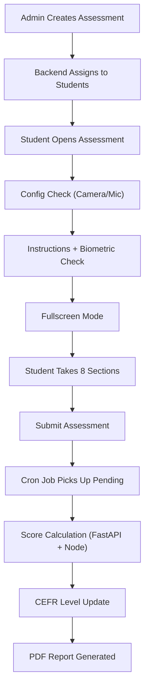

# Communication Assessment

> The Communication Assessment evaluates a student's **reading, listening, speaking, and writing** abilities using AI-powered scoring. Students are assigned a **CEFR level** (A1–C2) that adapts over time based on their performance.

---

## Overview

| Property | Value |
|---|---|
| **Assessment Type** | `Communication` |
| **CEFR Levels** | A1, A2, B1, B2, C1, C2 |
| **Domains** | Universal (default), or industry-specific |
| **Scoring Engine** | FastAPI AI Engine (Gemini/Groq + Azure Speech SDK) |
| **Report Format** | PDF (HTML-based via Handlebars) |

---

## Assessment Sections (8 Types)

| # | Section | Ability Tested | Scoring Method |
|---|---------|---------------|----------------|
| 1 | **Paragraph Reading** | Reading | Azure Speech SDK (pronunciation, fluency, completeness, prosody) + MCQ accuracy |
| 2 | **Audio Question** | Listening | MCQ-based (correct/total) |
| 3 | **Video Response** | Speaking | FastAPI AI analysis of recorded video (grammar, content, fluency) |
| 4 | **Question Based Response** | Speaking/Writing | AI evaluation of image description text (grammar, phrasing, vocabulary, coherence) |
| 5 | **Email Writing** | Writing | AI evaluation (phrasing, voice/tone, format, grammar, spelling) |
| 6 | **Dictation** | Writing | Text comparison (word accuracy, character accuracy, punctuation, capitalization) |
| 7 | **Sentence Completion** | Writing | Fill-in-the-blank correctness |
| 8 | **Sentence Build** | Writing | Drag-and-drop word ordering with normalized comparison |

---

## Final Score Weights

```
Final Score = (Video Response × 0.40)
            + (Paragraph Reading × 0.20)
            + (Audio Question × 0.10)
            + (Writing Sections × 0.30)

Writing Score = sum of present writing section scores / 4
Writing Sections = Question Based Response, Sentence Completion,
                   Sentence Build, Dictation OR Email Writing
```

> An assessment has either Dictation or Email Writing (controlled by `IsEmailWriting` flag), plus up to 3 other writing sections. The divisor is always **4** (hardcoded), not the count of present sections. This ensures consistent scoring across PDF report, dashboard, and `getAssessmentReport`.

**Score consistency rule:** All display surfaces (PDF report `generateCommunicationReport`, dashboard `getStudentListForAssessment`, detail view `getAssessmentReport`) must use stored `communicationScores.score` values directly and divide writing sum by 4. Do NOT recalculate section scores from metadata — use the stored score.

---

## End-to-End Flow



---

## File Reference

### 1. Assessment Creation (Admin)

#### Frontend — `AssessmentSelect.js`
**Path:** `admin-react/src/modules/Assessment/Partials/CreateAssessment/AssessmentSelect.js`

- Admin selects **assessment type** = `Communication`
- Configures: name, start/end date & time, CEFR level, domain, proctoring, student list
- Supports **one-time** or **scheduled** (daily/weekly/monthly/custom) distribution
- Dispatches `assignCommunicationAssessment` action to backend

#### Backend — `Assessment.js` → `assignCommunicationAssessment()`
**Path:** `admin-node/app/models/Assessment.js` (line ~4519)

**Key steps:**
1. Fetches students via `getAssessmentAssignedParticipants()` (from bulk upload or institute data)
2. **Determines CEFR level per student using `suggestedCefr` from `progression_history`:**
   - Queries `progression_history` for the latest `suggested_cefr` (non-null) per student email, filtered by `is_practice = false`
   - Uses raw SQL with `DISTINCT ON (LOWER(primary_email))` ordered by `submitted_at DESC`
   - First-time students (no progression record) → use the admin-selected CEFR level
   - Returning students → use `suggestedCefr` from their latest progression record
3. Generates question sets via `generateCommunicationQuestions()` which calls FastAPI `/communication/generate_questions`
4. Creates DB records:
   - `assessmentInstituteMap` — links assessment to institute
   - `assessmentSet` — stores generated questions with CEFR level
   - `assessmentAssignedStudent` — one per student, linked to an assessment set
5. Handles **set rotation** — tracks which sets have been assigned to avoid repetition
6. Creates students in the system if they don't exist yet (auto-registration)

#### Practice Assignment — `assignPracticeAssessmentCommunication()`
**Path:** `admin-node/app/models/Assessment.js`

Same flow as above but queries `progression_history` with `is_practice = true` for the latest `suggested_cefr`. Falls back to `practice_cefr` from `student_personal_profile` if no progression record exists.

> **Important:** Both practice and non-practice assignment use `suggestedCefr` from `progression_history` (not from `student_personal_profile`) to determine the CEFR level for question generation. This ensures the assigned level always reflects the latest progression-derived recommendation.

---

### 2. Student-Facing Frontend

**Path:** `Assessment-React/src/modules/Assessments/Partials/Communicationassmt/`

| File | Purpose |
|------|--------|
| `index.js` | Entry point — shows assessment name, deadline, **ConfigCheck** (camera/mic), Start button |
| `instruction.js` | Instructions page — runs **biometric check**, requests **fullscreen**, then navigates to assessment |
| `assessment.js` | **Main assessment UI** — renders all 8 section types, handles recording, navigation, timers, violation detection, auto-submit |
| `completion.js` | Thank-you page — shows submission confirmation, timer, navigates back |

**Key behaviors in `assessment.js`:**
- **Fullscreen enforcement** — enters fullscreen, detects violations (tab switch, right-click, copy-paste)
- **Recording** — uses MediaRecorder API for video/audio capture, uploads to OCI storage
- **Section navigation** — Next/Previous with response saving between sections
- **Auto-submit** — on timer expiry or too many violations
- **Drag-and-drop** — for Sentence Build section (uses `@dnd-kit`)
- **Anti-cheat** — blocks copy/paste, right-click, tracks fullscreen exits

---

### 3. Question Delivery (Student Backend)

#### `getCommunicationAssessmentQuestions()`
**Path:** `student-node/app/models/Assessment.js` (line ~2262)

**Key logic:**
1. Receives `assessment_set_id` and `assessment_assigned_id`
2. **CEFR level correction at delivery time** (institute assessments only):
   - Queries `progression_history` for the student's latest `suggestedCefr` (non-null), using the `isPractice` flag from the assignment
   - If the student has prior progression records, checks whether the assigned set's CEFR matches `suggestedCefr`
   - If mismatch → queries for all active sets at the correct CEFR level, randomly picks one, updates the assignment
   - This handles the case where a student's level changed between assignment and delivery
3. Fetches questions with sub-questions and options from the database
4. Organizes questions by section type (Paragraph Reading, Audio Question, Video Response, etc.)
5. Returns structured JSON for the frontend to render

---

### 4. Score Calculation

Scoring happens in two layers: **Node.js orchestration** and **FastAPI AI analysis**.

#### Orchestration — `CommunicationCalculations.js`
**Path:** `student-node/app/models/CommunicationCalculations.js`

| Function | What It Does |
|----------|-------------|
| `calculateParagraphReadingScore()` | Sends audio to FastAPI for speech analysis + checks MCQ answers. Combines both into overall score. |
| `calculateAudioQuestionScore()` | Pure MCQ scoring — counts correct answers out of total. |
| `calculateVideoQuestionScore()` | Sends video recordings to FastAPI for AI analysis of spoken responses. |
| `calculateQuestionBasedResponseScore()` | Sends image + text response to FastAPI for AI evaluation. |
| `calculateEmailWritingScore()` | Sends email content + prompt to FastAPI for writing quality analysis. |
| `calculateDictationScore()` | Sends user answer + reference to FastAPI for text comparison scoring. |
| `calculateSentenceCompletionScore()` | Sends fill-in-the-blank answers to FastAPI for evaluation. |
| `calculateSentenceBuildScore()` | Local scoring — normalizes and compares word order against correct answer. |
| `storeCommunicationScores()` | Stores all section scores in `communicationScores` table. Handles retakes (dedup). |

#### AI Scoring Engine — `communication.py`
**Path:** `fastapi-ai-engine/routers/communication.py`

| Endpoint | Purpose |
|----------|--------|
| `generate_questions` | Generates question sets using Gemini/Groq AI based on CEFR level and domain |
| `calculate_paragraph_reading_audio_score` | Uses **Azure Speech SDK** for pronunciation assessment — measures accuracy, completeness, fluency, prosody |
| `calculate_question_based_response_score` | AI evaluation of image description — grammar, phrasing, spelling, vocabulary, coherence |
| `calculate_email_writing_score` | AI evaluation of email — phrasing, voice/tone, format, grammar, spelling |
| `calculate_dictation_score_endpoint` | Compares user text vs reference — word accuracy, character accuracy, punctuation, capitalization |

**Speech scoring weights (Paragraph Reading):**
- Pronunciation (accuracy): 25%
- Completeness: 35%
- Fluency (pause detection): 25%
- Prosody (stress, intonation, rhythm): 15%

---

### 5. Final Score & CEFR Update

#### `CalculateFinalScore()`
**Path:** `student-node/app/models/Assessment.js` (line ~9557)

Applies weighted formula to section scores (Video 40%, Reading 20%, Audio 10%, Writing 30%).

#### `updateCurrCERFlevelOfStudent()`
**Path:** `student-node/app/models/Assessment.js` (line ~9963)

After scoring, updates the student's CEFR progression using a **rolling window of pairs**. This function is `await`ed (not fire-and-forget) because the cron job can retry failed calculations.

**Rolling window model:**

```
Assessments:  1    2    3    4    5    6
              └─pair─┘
                   └─pair─┘
                        └─pair─┘
                             └─pair─┘
                                  └─pair─┘
```

Pairs overlap: (1,2), (2,3), (3,4), etc. When a pair completes and level **stays same**, the newer assessment (A2) is reused as A1 of the next pair. When level **changes**, both are consumed and the next pair starts fresh.

**Step-by-step process:**

1. **Get current CEFR level** — from latest `progressionHistory.suggestedCefr` (non-null), or fallback to assessment set level for first-timers
2. **Fetch last two uncalculated assessments** — `is_calc = false` AND `scoresCalculated = true`, ordered `submittedAt DESC`
3. **Query `latestProgression`** — finds the most recent `isSecondInPair = true` record (completed pair A2), which carries valid `assessmentCefr` and `suggestedCefr`. This is used for `previousProgressionLevel` and `carriedSuggestedCefr`.
4. **Single assessment (incomplete pair):**
   - Creates ProgressionHistory with `isSecondInPair = false`
   - **Sets `suggestedCefr = carriedSuggestedCefr`** (carry-forward from previous pair's A2 record)
   - **Sets `assessmentCefr = previousProgressionLevel`** (carry-forward)
   - Does NOT mark `is_calc` — the assessment stays available for pairing
5. **Pair complete:**
   - `fetchLastTwo` returns `[assessment1 (newer), assessment2 (older)]` (DESC order)
   - **assessment2 (older) = A1 of pair** — carries forward `assessmentCefr` and `suggestedCefr` from previous pair
   - **assessment1 (newer) = A2 of pair** — gets **derived** `suggestedCefr`, `assessmentCefr` (newProgressionLevel), NPS, pairAverageScore
   - Calculates pair average: `(finalScore1 + finalScore2) / 2`
   - NPS formula: `((CefrRankIndex × 100) + avgScore) / 6` (0–100 scale)
   - Applies progression rules (see below)
   - **Marking for rolling window:**
     - **Always** marks assessment2 (older/A1) as `is_calc = true` (consumed)
     - If level **changed**: also marks assessment1 (newer/A2) as `is_calc = true` (clean break)
     - If level **same**: assessment1 (newer/A2) stays `is_calc = false` → becomes A1 of next pair
   - Updates `studentPersonalProfile.AssessmentCEFR` to `suggestedCefr`

> **Rolling window correctness:** The OLDER assessment is always consumed, the NEWER one stays for reuse. This ensures pairs chain as (1,2), (2,3), (3,4). If the newer were consumed instead, the older would become a "zombie anchor" that perpetually pairs with every new assessment: (1,2), (1,3), (1,4)...

> **latestProgression query:** Uses `isSecondInPair: true` filter (not ID-based exclusion) to find the previous pair's A2 record. This correctly handles the rolling window case where the current pair's A1 (assessment2) IS the previous pair's A2 — its record still has `isSecondInPair: true` in the DB at query time (before the upsert overwrites it as A1). ID-based exclusion would incorrectly skip this record.

> **suggestedCefr Carry-Forward Rule:** `suggestedCefr` is only _derived_ when A2 (second-in-pair) completes. For A1 records and incomplete pairs, `suggestedCefr` carries forward from the previous pair's A2 value. This ensures `suggestedCefr` is **never null** except for the very first assessment (which has no previous pair). This is critical because `suggestedCefr` is used for assignment-level determination — a null value would cause fallback to stale data.

> **assessmentCefr Carry-Forward Rule:** `assessmentCefr` (confirmed progression level) is only _derived_ when A2 completes a pair. For A1 records, `assessmentCefr` carries forward `previousProgressionLevel` from the latest completed A2 record. Only null on the very first assessment.

**Progression Rules:**

| # | Condition | Result |
|---|-----------|--------|
| 1 | **Diagnosis** (first pair ever) | `newProgressionLevel = min(assessmentLevel, calculatedLevel)` — prevents inflated start |
| 2 | **Non-diagnosis, non-practice** — high score (suggestedCefr moves up) | `newProgressionLevel = currentAssessmentLevel` — confirmed at current level |
| 3 | **Non-diagnosis, non-practice** — low score (suggestedCefr stays same) | `newProgressionLevel = currentAssessmentLevel - 1` (A1 floor) — not yet confirmed |
| 4 | **C2 special case** — score ≥ 86 | `newProgressionLevel = C2` — can't go higher, confirmed at ceiling |
| 5 | **No-downgrade rule** (all cases) | `newProgressionLevel = max(newLevel, previousProgressionLevel)` — level never drops |
| 6 | **Practice** | `newProgressionLevel = assessmentLevel` — unrestricted |

**Progression mapping table** (non-diagnosis, non-practice):

| Current Level | Low Score | Progression | High Score | Progression |
|---|---|---|---|---|
| A1 | 0–80 | A1 | 81–100 | A1 |
| A2 | 0–85 | A1 | 86–100 | A2 |
| B1 | 0–85 | A2 | 86–100 | B1 |
| B2 | 0–85 | B1 | 86–100 | B2 |
| C1 | 0–87 | B2 | 88–100 | C1 |
| C2 | 0–85 | C1 | 86–100 | C2 |

> **Key insight:** Progression level is always one level below the student's current assessment level until they score high enough for suggestedCefr to move up. At that point, progression confirms at the current level. Once confirmed, no-downgrade ensures it never drops back.

**`suggestedCefr` calculation:**
- Raw suggested level comes from `getNewCERFlevel(assessmentLevel, avgScore)` mapping
- No-downgrade applied: `suggestedCefr = max(calculatedNewLevel, previousProgressionLevel)`
- Written to profile as `AssessmentCEFR` — drives next test set assignment

**Rolling Window Pair Marking (`is_calc` flag on `assessmentAssignedStudent`):**
- **Level same:** Mark assessment2 (older/A1) `is_calc = true` (consumed). Assessment1 (newer/A2) stays `is_calc = false` → reused as A1 of next pair. Produces chain: (1,2), (2,3), (3,4)...
- **Level changed:** Mark **both** `is_calc = true` (clean break). Next assessment starts a fresh pair at the new level.
- The `fetchLastTwoComunnicationAssessments` query filters `is_calc = false` to find the two most recent uncalculated assessments. The reused A2 (now acting as A1) is always the older of the two found.

**CEFR Mapping (Assessment mode)** — `newCERFmapping.js`:

| Current Level | Score 0–85 | Score 86–100 |
|---|---|---|
| A1 | Stay A1 (0–80) | Suggest A2 (81–100) |
| A2 | Stay A2 (0–85) | Suggest B1 (86–100) |
| B1 | Stay B1 (0–85) | Suggest B2 (86–100) |
| B2 | Stay B2 (0–85) | Suggest C1 (86–100) |
| C1 | Stay C1 (0–87) | Suggest C2 (88–100) |
| C2 | Stay C2 (all) | — |

> **Key distinction:** `suggestedCefr` drives the **next test level** (written to profile). `assessmentCefr` is the **confirmed progression level** (written to ProgressionHistory). These can differ — e.g., student at A2 scores 91% → suggested=B1, progression=A2 (until confirmed at B1 level with a pair there).

**ProgressionHistory fields stored per record:**

| Field | Description |
|-------|-------------|
| `assessmentCefr` | Confirmed progression level (source of truth for "current level") |
| `suggestedCefr` | Level that drives next test assignment. **Derived** on A2 records; **carried forward** on A1 records from previous pair's A2. Only null on the very first assessment. |
| `assessmentCefrAtTime` | Student's CEFR at the time of this assessment |
| `assessmentCommunicationProgressScore` | NPS score |
| `isSecondInPair` | `true` for A2 (pair complete), `false` for A1 |
| `pairNumber` | Pair counter |
| `pairAverageScore` | Average of the two assessments in the pair |
| `finalScore` | Individual assessment score |
| `isDiagnosis` | Whether this was a diagnosis assessment |
| `isPractice` | Practice vs assessment mode |

---

### 6. Progression & Dashboard Data Sources

#### `fetchCommunicationProgression()`
**Path:** `student-node/app/models/Assessment.js` (line ~9050)

Compares the student's **last two communication assessments** to show improvement:
- Fetches the two most recent completed assessments at the same CEFR level
- Computes per-section and per-ability deltas (Reading, Listening, Speaking, Writing)
- Calculates weighted writing scores across all writing sub-modules
- Returns progression data with before/after scores and delta indicators
- Reads confirmed CEFR from `ProgressionHistory.assessmentCefr` (not the simulative replay)

**Progression data includes:**
- CEFR level change
- Overall score change
- Per-ability score changes
- Section breakdown comparison

#### Dashboard Data Sources (TpoDashBoard.js)

| Column | Data Source | Notes |
|---|---|---|
| **Progression Level** | `ProgressionHistory.assessmentCefr` | Scoped by `assessmentAssignedId` for per-assessment views; A2 record preferred, fallback to A1 |
| **NPS (Communication)** | `ProgressionHistory.assessmentCommunicationProgressScore` | Same source as level — ensures consistency |
| **Assigned Level** | Previous `ProgressionHistory.suggestedCefr` (non-null, before current assessment) | Queries `progressionHistory` directly for the latest record with non-null `suggestedCefr` where `submittedAt < currentAssessment.submittedAt` and `assessmentAssignedId != currentAssessmentId`. Falls back to `assessmentSet.cefrLevel` only for diagnosis (first-ever assessment). |

> **Important:** Dashboard reads progression level from `ProgressionHistory` scoped by `assessmentAssignedId` (not latest-by-email), ensuring each assessment view shows the correct level for that specific assessment. The `assignedLevel` queries `progressionHistory` for the latest non-null `suggestedCefr` before the current assessment — this is the value that actually drove the test set assignment. Do NOT use `assessmentSet.cefrLevel` as fallback for non-diagnosis assessments, because the set's CEFR can become stale when the student's level changes between assignment and delivery.

#### Progression Query Scoping

When viewing a **specific assessment's** student list (`getStudentListForAssessment`), progression queries are scoped by `assessmentAssignedId` to show the level achieved on that particular assessment — not the student's latest level across all assessments.

When viewing the **total candidate list** (`getStudentListForTpoDashboard`), queries use `primaryEmail` with `orderBy: submittedAt desc` to show the student's most recent level.

This distinction prevents confusion when viewing historical assessments where a student's level was different than their current level.

---

### 7. Cron Job (Pending Score Processing)

#### `calculatePendingAssessmentCron.js`
**Path:** `student-node/script/calculatePendingAssessmentCron.js`

**Runs periodically to process submitted but un-scored assessments:**

1. **Fix inconsistent rows** — where `calculationError=true` but `scoresCalculated=true`
2. **Reset stale locks** — assessments locked for processing > 30 minutes
3. **Find ONE pending assessment** — oldest first (`submitted=true`, `scoresCalculated=false`, `isProcessing=false`)
4. **Atomic claim** — uses `updateMany` with `isProcessing: false` condition (prevents double-processing across K8s pods)
5. **Calculate score** — calls `calculateAssessmentScore()`
6. **Retry logic:**
   - Non-transient errors: max **3 attempts** → marks `calculationError=true`
   - Transient errors (timeout, 502/503/504): max **10 attempts** → retries next cycle
7. **Release lock** on success, reset attempt counter

---

### 8. Backfill API

#### `POST /assessment/backfill-progression`
**Handler:** `assessmentHandler.backfillProgressionHistory`
**Method:** `CommunicationCalculations.backfillAllStudentProgression()`

Recalculates all communication progression history for every student:
1. Finds all students with calculated communication assessments
2. For each student, fetches all assessments ordered by `submittedAt ASC` (chronological)
3. Separates into practice vs assessment chains via `processProgressionChain()`
4. Replays each chain: rebuilds rolling window pairs, NPS, progression levels, and suggestedCefr
5. Upserts `ProgressionHistory` records by `assessmentAssignedId`
6. **Sets `is_calc = true`** on consumed assessments (older/A1 always; newer/A2 only if level changed) — ensures the live function doesn't re-pair already-processed assessments
7. Updates `studentPersonalProfile.AssessmentCEFR` (or `PracticeCEFR`) with final state

**Rolling window in backfill (`processProgressionChain`):**
- Tracks `unresolvedAssessment` (the pending A1) across the chain
- When a pair completes and level stays same: `unresolvedAssessment = currentAssessment` (newer becomes A1 of next pair)
- When level changes: `unresolvedAssessment = null` (clean break)
- This produces the correct chain: (1,2), (2,3), (3,4)... matching the live function

**suggestedCefr carry-forward in backfill:**
- Tracks `effectiveCefrLevel` across the chain (starts null for 1st assessment)
- A1 records: `suggestedCefr = effectiveCefrLevel` (carried forward from previous pair)
- A2 records: `suggestedCefr = newlyDerivedSuggestedCefr` (fresh calculation)
- After each pair completes, `effectiveCefrLevel` updates to the new `suggestedCefr`

**`is_calc` marking in backfill:**
- After pair completes: always marks `unresolvedAssessment` (older/A1) as `is_calc = true`
- If level changed: also marks `currentAssessment` (newer/A2) as `is_calc = true`
- This keeps backfill and live function in sync — prevents live function from re-pairing backfilled assessments

**Request body:** `{}` (no parameters needed)

Use this after fixing progression/scoring bugs to recalculate all historical data.

---

### 9. PDF Report

#### Template — `communicationReport.html`
**Path:** `student-node/public/communicationReport.html`

#### Generator — `generateCommunicationReport()`
**Path:** `student-node/app/models/Assessment.js` (line ~7533)

- Uses **Handlebars** template engine to render HTML
- Converts HTML to PDF using Puppeteer
- Report includes:
  - Student info (name, age, institute)
  - Overall CEFR level
  - Ability-wise breakdown (Reading, Listening, Speaking, Writing)
  - Per-section scores with detailed metrics
  - Progression comparison (if previous assessment exists)

---

## Database Tables (Key)

| Table | Purpose |
|-------|--------|
| `assessment_type` | Stores assessment types (Communication, Aptitude, etc.) |
| `assessment_set` | Generated question sets with CEFR level and domain |
| `assessment_institute_map` | Links assessment to institute/corporate |
| `assessment_assigned_students` | Per-student assignment (tracks status, scores, attempts) |
| `communication_scores` | Individual section scores with metadata |
| `student_personal_profile` | Stores `AssessmentCEFR` and `PracticeCEFR` per student |
| `progression_history` | Stores confirmed CEFR level, NPS, pair data per assessment |
| `question` / `sub_question` / `option` | Question bank structure |
| `assessment_section` | Section definitions (Paragraph Reading, Audio Question, etc.) |

---

## Key Concepts

- **CEFR (Common European Framework of Reference)** — A1 (beginner) to C2 (mastery). Each student has a current CEFR level that adapts based on their assessment performance.
- **Assessment Sets** — Pre-generated question packs at a specific CEFR level. Multiple sets exist per level to allow rotation.
- **Set Rotation** — The system tracks which sets a student has already seen and assigns unseen ones.
- **Practice vs Assessment** — Practice assessments update `PracticeCEFR`; real assessments update `AssessmentCEFR`.
- **Proctoring** — Optional face detection during assessment (snapshots sent to FastAPI for validation).
- **Retake** — Students may retake; scores are stored separately with `isRetake` flag.
- **suggestedCefr vs assessmentCefr (newProgressionLevel)** — `suggestedCefr` drives the **next test level** (written to profile as `AssessmentCEFR`). `assessmentCefr` is the **confirmed progression level** (written to ProgressionHistory, read by dashboard). These can differ — e.g., student at A2 scores 91% → `suggestedCefr=B1` (next test at B1), `assessmentCefr=A2` (confirmed at A2, until they prove themselves at B1 with a pair there). Both are only _derived_ on A2 records; A1 records carry forward from the previous A2.
- **Rolling window pair model** — Pairs overlap: (1,2), (2,3), (3,4), etc. The **older** assessment (A1) is consumed (`is_calc = true`), the **newer** (A2) stays for reuse as A1 of the next pair. When level changes, both are consumed (clean break). The `latestProgression` query uses `isSecondInPair: true` to find the previous pair's A2 record for carry-forward — this correctly handles the rolling window case where the reused assessment still has its A2 data in the DB at query time.
- **Backfill sets `is_calc`** — The backfill API marks consumed assessments as `is_calc = true`, matching the live function's behavior. This prevents the live function from re-pairing already-processed assessments after a backfill.
- **Reliability model** — `updateCurrCERFlevelOfStudent` is `await`ed (not fire-and-forget). If it fails, the cron job will retry the entire score calculation including progression. This is safe because communication scoring is cron-driven with retry logic (up to 3 non-transient retries, 10 transient retries).
