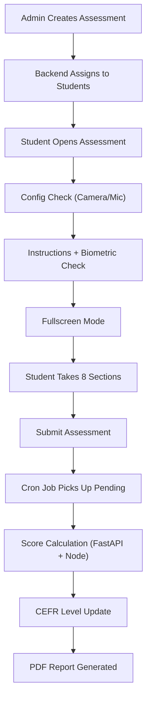

# Communication Assessment

> The Communication Assessment evaluates a student's **reading, listening, speaking, and writing** abilities using AI-powered scoring. Students are assigned a **CEFR level** (A1–C2) that adapts over time based on their performance.

---

## Overview

| Property | Value |
|---|---|
| **Assessment Type** | `Communication` |
| **CEFR Levels** | A1, A2, B1, B2, C1, C2 |
| **Domains** | Universal (default), or industry-specific |
| **Scoring Engine** | FastAPI AI Engine (Gemini/Groq + Azure Speech SDK) |
| **Report Format** | PDF (HTML-based via Handlebars) |

---

## Assessment Sections (8 Types)

| # | Section | Ability Tested | Scoring Method |
|---|---------|---------------|----------------|
| 1 | **Paragraph Reading** | Reading | Azure Speech SDK (pronunciation, fluency, completeness, prosody) + MCQ accuracy |
| 2 | **Audio Question** | Listening | MCQ-based (correct/total) |
| 3 | **Video Response** | Speaking | FastAPI AI analysis of recorded video (grammar, content, fluency) |
| 4 | **Question Based Response** | Speaking/Writing | AI evaluation of image description text (grammar, phrasing, vocabulary, coherence) |
| 5 | **Email Writing** | Writing | AI evaluation (phrasing, voice/tone, format, grammar, spelling) |
| 6 | **Dictation** | Writing | Text comparison (word accuracy, character accuracy, punctuation, capitalization) |
| 7 | **Sentence Completion** | Writing | Fill-in-the-blank correctness |
| 8 | **Sentence Build** | Writing | Drag-and-drop word ordering with normalized comparison |

---

## Final Score Weights

```
Final Score = (Video Response × 0.40)
            + (Paragraph Reading × 0.20)
            + (Audio Question × 0.10)
            + (Writing Sections × 0.30)

Writing Score = sum of present writing section scores / 4
Writing Sections = Question Based Response, Sentence Completion,
                   Sentence Build, Dictation OR Email Writing
```

> An assessment has either Dictation or Email Writing (controlled by `IsEmailWriting` flag), plus up to 3 other writing sections. The divisor is always **4** (hardcoded), not the count of present sections. This ensures consistent scoring across PDF report, dashboard, and `getAssessmentReport`.

**Score consistency rule:** All display surfaces (PDF report `generateCommunicationReport`, dashboard `getStudentListForAssessment`, detail view `getAssessmentReport`) must use stored `communicationScores.score` values directly and divide writing sum by 4. Do NOT recalculate section scores from metadata — use the stored score.

---

## End-to-End Flow



---

## File Reference

### 1. Assessment Creation (Admin)

#### Frontend — `AssessmentSelect.js`
**Path:** `admin-react/src/modules/Assessment/Partials/CreateAssessment/AssessmentSelect.js`

- Admin selects **assessment type** = `Communication`
- Configures: name, start/end date & time, CEFR level, domain, proctoring, student list
- Supports **one-time** or **scheduled** (daily/weekly/monthly/custom) distribution
- Dispatches `assignCommunicationAssessment` action to backend

#### Backend — `Assessment.js` → `assignCommunicationAssessment()`
**Path:** `admin-node/app/models/Assessment.js` (line ~4519)

**Key steps:**
1. Fetches students via `getAssessmentAssignedParticipants()` (from bulk upload or institute data)
2. **Determines CEFR level per student using `suggestedCefr` from `progression_history`:**
   - Queries `progression_history` for the latest `suggested_cefr` (non-null) per student email, filtered by `is_practice = false`
   - Uses raw SQL with `DISTINCT ON (LOWER(primary_email))` ordered by `submitted_at DESC`
   - First-time students (no progression record) → use the admin-selected CEFR level
   - Returning students → use `suggestedCefr` from their latest progression record
3. Generates question sets via `generateCommunicationQuestions()` which calls FastAPI `/communication/generate_questions`
4. Creates DB records:
   - `assessmentInstituteMap` — links assessment to institute
   - `assessmentSet` — stores generated questions with CEFR level
   - `assessmentAssignedStudent` — one per student, linked to an assessment set
5. Handles **set rotation** — tracks which sets have been assigned to avoid repetition
6. Creates students in the system if they don't exist yet (auto-registration)

#### Practice Assignment — `assignPracticeAssessmentCommunication()`
**Path:** `admin-node/app/models/Assessment.js`

Same flow as above but queries `progression_history` with `is_practice = true` for the latest `suggested_cefr`. Falls back to `practice_cefr` from `student_personal_profile` if no progression record exists.

> **Important:** Both practice and non-practice assignment use `suggestedCefr` from `progression_history` (not from `student_personal_profile`) to determine the CEFR level for question generation. This ensures the assigned level always reflects the latest progression-derived recommendation.

---

### 2. Student-Facing Frontend

**Path:** `Assessment-React/src/modules/Assessments/Partials/Communicationassmt/`

| File | Purpose |
|------|--------|
| `index.js` | Entry point — shows assessment name, deadline, **ConfigCheck** (camera/mic), Start button |
| `instruction.js` | Instructions page — runs **biometric check**, requests **fullscreen**, then navigates to assessment |
| `assessment.js` | **Main assessment UI** — renders all 8 section types, handles recording, navigation, timers, violation detection, auto-submit |
| `completion.js` | Thank-you page — shows submission confirmation, timer, navigates back |

**Key behaviors in `assessment.js`:**
- **Fullscreen enforcement** — enters fullscreen, detects violations (tab switch, right-click, copy-paste)
- **Recording** — uses MediaRecorder API for video/audio capture, uploads to OCI storage
- **Section navigation** — Next/Previous with response saving between sections
- **Auto-submit** — on timer expiry or too many violations
- **Drag-and-drop** — for Sentence Build section (uses `@dnd-kit`)
- **Anti-cheat** — blocks copy/paste, right-click, tracks fullscreen exits

---

### 3. Question Delivery (Student Backend)

#### `getCommunicationAssessmentQuestions()`
**Path:** `student-node/app/models/Assessment.js` (line ~2262)

**Key logic:**
1. Receives `assessment_set_id` and `assessment_assigned_id`
2. **CEFR level correction at delivery time** (institute assessments only):
   - Queries `progression_history` for the student's latest `suggestedCefr` (non-null), using the `isPractice` flag from the assignment
   - If the student has prior progression records, checks whether the assigned set's CEFR matches `suggestedCefr`
   - If mismatch → queries for all active sets at the correct CEFR level, randomly picks one, updates the assignment
   - This handles the case where a student's level changed between assignment and delivery
3. Fetches questions with sub-questions and options from the database
4. Organizes questions by section type (Paragraph Reading, Audio Question, Video Response, etc.)
5. Returns structured JSON for the frontend to render

---

### 4. Score Calculation

Scoring happens in two layers: **Node.js orchestration** and **FastAPI AI analysis**.

#### Orchestration — `CommunicationCalculations.js`
**Path:** `student-node/app/models/CommunicationCalculations.js`

| Function | What It Does |
|----------|-------------|
| `calculateParagraphReadingScore()` | Sends audio to FastAPI for speech analysis + checks MCQ answers. Combines both into overall score. |
| `calculateAudioQuestionScore()` | Pure MCQ scoring — counts correct answers out of total. |
| `calculateVideoQuestionScore()` | Sends video recordings to FastAPI for AI analysis of spoken responses. |
| `calculateQuestionBasedResponseScore()` | Sends image + text response to FastAPI for AI evaluation. |
| `calculateEmailWritingScore()` | Sends email content + prompt to FastAPI for writing quality analysis. |
| `calculateDictationScore()` | Sends user answer + reference to FastAPI for text comparison scoring. |
| `calculateSentenceCompletionScore()` | Sends fill-in-the-blank answers to FastAPI for evaluation. |
| `calculateSentenceBuildScore()` | Local scoring — normalizes and compares word order against correct answer. |
| `storeCommunicationScores()` | Stores all section scores in `communicationScores` table. Handles retakes (dedup). |

#### AI Scoring Engine — `communication.py`
**Path:** `fastapi-ai-engine/routers/communication.py`

| Endpoint | Purpose |
|----------|--------|
| `generate_questions` | Generates question sets using Gemini/Groq AI based on CEFR level and domain |
| `calculate_paragraph_reading_audio_score` | Uses **Azure Speech SDK** for pronunciation assessment — measures accuracy, completeness, fluency, prosody |
| `calculate_question_based_response_score` | AI evaluation of image description — grammar, phrasing, spelling, vocabulary, coherence |
| `calculate_email_writing_score` | AI evaluation of email — phrasing, voice/tone, format, grammar, spelling |
| `calculate_dictation_score_endpoint` | Compares user text vs reference — word accuracy, character accuracy, punctuation, capitalization |

**Speech scoring weights (Paragraph Reading):**
- Pronunciation (accuracy): 25%
- Completeness: 35%
- Fluency (pause detection): 25%
- Prosody (stress, intonation, rhythm): 15%

---

### 5. Final Score & CEFR Update

#### `CalculateFinalScore()`
**Path:** `student-node/app/models/Assessment.js` (line ~9557)

Applies weighted formula to section scores (Video 40%, Reading 20%, Audio 10%, Writing 30%).

#### `updateCurrCERFlevelOfStudent()` → `replayCommunicationProgression()`
**Path:** `student-node/app/models/Assessment.js`; pure core in `student-node/app/helpers/communicationProgression.js`

After scoring, the student's **entire** Communication chain (for one `is_practice` value) is recomputed deterministically and every `progression_history` row is re-upserted. The live path (`updateCurrCERFlevelOfStudent` → `replayCommunicationProgression`) and the **backfill** (`CommunicationCalculations.backfillAllStudentProgression`) call the **same pure core** (`computeCommunicationChain`), so they can never diverge. This replaced the old "rolling window of pairs" + `is_calc` machinery, which let the live and backfill paths drift apart (causing missing/stale latest CEFR in the frontend and the need for repeated manual backfills).

**Model — each row is derived from its assessment and its immediate predecessor:**
- The **first two** assessments are the **diagnosis**.
- `avg = (total_predecessor + total_current) / 2`.
- If the current assessment's **set CEFR level equals the predecessor's**, the pair **derives** a new level; otherwise the row **carries forward** the predecessor's `progression`/`suggested` (and waits for a same-level partner).
- There is **no `is_calc` / consume / clean-break bookkeeping** — every row simply looks back one assessment.

**Level derivation (`deriveCommunicationLevels`):**

```
newLevel    = getNewCERFlevel(setLevel, avg, isPractice, isDiagnosis)
suggested   = newLevel
```

| Phase | Mapping used | progression |
|---|---|---|
| **Diagnosis** (first 2) | `cerfMapping` (detailed bands; downgrade allowed for calibration) | `= suggested`, **except** `C2 → C1` (C2 means "suggest C2 test", not a confirmed level) |
| **Post-diagnosis** | `assessmentCefrMapping` (stay-or-up) | `= one rank below suggested` (floor A1) |

- **No-downgrade** (assessment chains, post-diagnosis only): `suggested = max(suggested, prevSuggested)`, `progression = max(progression, prevProgression)`. Because `previousSuggested` is null only at the diagnosis pair, downgrade is automatically allowed there and blocked afterward.
- **Practice chains** skip the no-downgrade clamp — practice **may drift down** to always reflect the latest mapped level.

**The diagnosis→post-diagnosis seam:** diagnosis seeds `progression = suggested`; post-diagnosis wants `progression = suggested − 1`. No-downgrade absorbs the gap, so a student confirmed at e.g. A2 by diagnosis **stays** at A2 and only ever ratchets **up** when a same-level pair scores ≥86.

**NPS** — one formula, anchored at each half's own confirmed level (auto-bridges on a level change):

```
NPS(row) = avg( communicationNPS(progression_predecessor, total_predecessor),
                communicationNPS(progression_current,     total_current) )
```
where `communicationNPS(level, score) = (rankIndex × 100 + score) / 6` (A1=0 … C2=5). When the predecessor has no progression yet (diagnosis #1), both halves anchor at the current progression.

**Worked example (set levels B1,B1,A2,A2,A2,B1,B1; non-practice):**

| # | set | score | progression | suggested | note |
|---|---|---|---|---|---|
| 1 | B1 | 60 | null | null | diagnosis #1 (no predecessor) |
| 2 | B1 | 78 | A2 | A2 | diagnosis #2 (cerfMapping; prog = sugg) |
| 3 | A2 | 82 | A2 | A2 | carry (set shifted B1→A2) |
| 4 | A2 | 80 | A2 | A2 | derive **stay** (no-downgrade holds A2) |
| 5 | A2 | 94 | A2 | B1 | derive **move-up** (suggested↑, prog held) |
| 6 | B1 | 78 | A2 | B1 | carry at new level |
| 7 | B1 | 98 | B1 | B2 | derive move-up → **prog A2→B1, bridge NPS** |

> **C2 ceiling:** post-diagnosis `progression = suggested − 1` caps confirmed progression at **C1** (a student tested at C2 keeps progression C1). Only the diagnosis can confirm via the cerfMapping bands.

**Profile update (`_updateProfileCefr`, keyed by `primaryEmail`):** from the latest row's `suggestedCefr` — first-timer seeds `PracticeCEFR`/`AssessmentCEFR`/`MaxPracticeCEFR`; practice updates `PracticeCEFR` (+`MaxPracticeCEFR` if higher); non-practice updates `AssessmentCEFR` (drives next-test assignment). The triggering assessment's `resultingCefr` is also stamped with its suggested level.

> **Key distinction:** `suggestedCefr` drives the **next test level** (profile `AssessmentCEFR`). `assessmentCefr`/`practiceCefr` is the **confirmed progression level** read by the frontend/report (`getAllAssessmentScores` reads `progression_history.assessmentCefr` per assessment and skips nulls). They differ by one rank post-diagnosis (e.g. confirmed A2, suggested B1).

**ProgressionHistory fields stored per record:**

| Field | Description |
|-------|-------------|
| `assessmentCefr` / `practiceCefr` | Confirmed progression level (source of truth for "current level"); one written per `isPractice` |
| `suggestedCefr` | Next-test level; null only on the very first assessment of the chain |
| `assessmentCefrAtTime` | Set CEFR level this assessment was taken at |
| `assessmentCommunicationProgressScore` / `practiceCommunicationProgressScore` | NPS (0–100) |
| `isSecondInPair` | `true` for every row that completed a pair with its predecessor; `false` only for diagnosis #1 |
| `isDiagnosis` | `true` for the first two assessments |
| `pairNumber` | Position in the chain (informational; no consumer reads it) |
| `pairAverageScore` | `(total_predecessor + total_current)/2` |
| `finalScore` | Individual assessment score |
| `isPractice` | Practice vs assessment chain |

> **`is_calc` is no longer used** by progression. The old `fetchLastTwoComunnicationAssessments` and `markAssessmentAsCalculated` helpers are dead (no callers); the column is left intact but read by nothing in the communication flow.

---

### 6. Progression & Dashboard Data Sources

#### `fetchCommunicationProgression()`
**Path:** `student-node/app/models/Assessment.js` (line ~9050)

Compares the student's **last two communication assessments** to show improvement:
- Fetches the two most recent completed assessments at the same CEFR level
- Computes per-section and per-ability deltas (Reading, Listening, Speaking, Writing)
- Calculates weighted writing scores across all writing sub-modules
- Returns progression data with before/after scores and delta indicators
- Reads confirmed CEFR from `ProgressionHistory.assessmentCefr` (not the simulative replay)

**Progression data includes:**
- CEFR level change
- Overall score change
- Per-ability score changes
- Section breakdown comparison

#### Dashboard Data Sources (TpoDashBoard.js)

| Column | Data Source | Notes |
|---|---|---|
| **Progression Level** | `ProgressionHistory.assessmentCefr` | Scoped by `assessmentAssignedId` for per-assessment views; A2 record preferred, fallback to A1 |
| **NPS (Communication)** | `ProgressionHistory.assessmentCommunicationProgressScore` | Same source as level — ensures consistency |
| **Assigned Level** | Previous `ProgressionHistory.suggestedCefr` (non-null, before current assessment) | Queries `progressionHistory` directly for the latest record with non-null `suggestedCefr` where `submittedAt < currentAssessment.submittedAt` and `assessmentAssignedId != currentAssessmentId`. Falls back to `assessmentSet.cefrLevel` only for diagnosis (first-ever assessment). |

> **Important:** Dashboard reads progression level from `ProgressionHistory` scoped by `assessmentAssignedId` (not latest-by-email), ensuring each assessment view shows the correct level for that specific assessment. The `assignedLevel` queries `progressionHistory` for the latest non-null `suggestedCefr` before the current assessment — this is the value that actually drove the test set assignment. Do NOT use `assessmentSet.cefrLevel` as fallback for non-diagnosis assessments, because the set's CEFR can become stale when the student's level changes between assignment and delivery.

#### Progression Query Scoping

When viewing a **specific assessment's** student list (`getStudentListForAssessment`), progression queries are scoped by `assessmentAssignedId` to show the level achieved on that particular assessment — not the student's latest level across all assessments.

When viewing the **total candidate list** (`getStudentListForTpoDashboard`), queries use `primaryEmail` with `orderBy: submittedAt desc` to show the student's most recent level.

This distinction prevents confusion when viewing historical assessments where a student's level was different than their current level.

---

### 7. Cron Job (Pending Score Processing)

#### `calculatePendingAssessmentCron.js`
**Path:** `student-node/script/calculatePendingAssessmentCron.js`

**Runs periodically to process submitted but un-scored assessments:**

1. **Fix inconsistent rows** — where `calculationError=true` but `scoresCalculated=true`
2. **Reset stale locks** — assessments locked for processing > 30 minutes
3. **Find ONE pending assessment** — oldest first (`submitted=true`, `scoresCalculated=false`, `isProcessing=false`)
4. **Atomic claim** — uses `updateMany` with `isProcessing: false` condition (prevents double-processing across K8s pods)
5. **Calculate score** — calls `calculateAssessmentScore()`
6. **Retry logic:**
   - Non-transient errors: max **3 attempts** → marks `calculationError=true`
   - Transient errors (timeout, 502/503/504): max **10 attempts** → retries next cycle
7. **Release lock** on success, reset attempt counter

---

### 8. Backfill API

#### `POST /assessment/backfill-progression`
**Handler:** `assessmentHandler.backfillProgressionHistory`
**Method:** `CommunicationCalculations.backfillAllStudentProgression()`

Recalculates communication progression history for every student (or a filtered subset):
1. Finds distinct students with calculated communication assessments (optionally scoped by `primaryEmails`)
2. For each student, calls `assessmentObj.replayCommunicationProgression(email, isPractice)` for **both** `false` and `true` chains
3. `replayCommunicationProgression` fetches the full chain, scores each assessment, runs the shared pure core (`computeCommunicationChain`), upserts every `progression_history` row, and updates the profile

> **Live and backfill are the same code.** The backfill no longer has its own pairing/`is_calc` logic — it routes through the identical `replayCommunicationProgression` the live path uses, so the two cannot diverge. Because the replay is a deterministic full-chain recompute (idempotent upsert per assessment), running it is safe and self-correcting; there is no `is_calc` to keep in sync.

**Request body:** `{ "primaryEmails": ["a@x.com", ...] }` (optional — omit to process all students). `batchSize` optional (default 50).

Use this after fixing progression/scoring bugs to recalculate historical data, or scoped to specific students to repair them.

---

### 9. PDF Report

#### Template — `communicationReport.html`
**Path:** `student-node/public/communicationReport.html`

#### Generator — `generateCommunicationReport()`
**Path:** `student-node/app/models/Assessment.js` (line ~7533)

- Uses **Handlebars** template engine to render HTML
- Converts HTML to PDF using Puppeteer
- Report includes:
  - Student info (name, age, institute)
  - Overall CEFR level
  - Ability-wise breakdown (Reading, Listening, Speaking, Writing)
  - Per-section scores with detailed metrics
  - Progression comparison (if previous assessment exists)

---

## Database Tables (Key)

| Table | Purpose |
|-------|--------|
| `assessment_type` | Stores assessment types (Communication, Aptitude, etc.) |
| `assessment_set` | Generated question sets with CEFR level and domain |
| `assessment_institute_map` | Links assessment to institute/corporate |
| `assessment_assigned_students` | Per-student assignment (tracks status, scores, attempts) |
| `communication_scores` | Individual section scores with metadata |
| `student_personal_profile` | Stores `AssessmentCEFR` and `PracticeCEFR` per student |
| `progression_history` | Stores confirmed CEFR level, NPS, pair data per assessment |
| `question` / `sub_question` / `option` | Question bank structure |
| `assessment_section` | Section definitions (Paragraph Reading, Audio Question, etc.) |

---

## Key Concepts

- **CEFR (Common European Framework of Reference)** — A1 (beginner) to C2 (mastery). Each student has a current CEFR level that adapts based on their assessment performance.
- **Assessment Sets** — Pre-generated question packs at a specific CEFR level. Multiple sets exist per level to allow rotation.
- **Set Rotation** — The system tracks which sets a student has already seen and assigns unseen ones.
- **Practice vs Assessment** — Practice assessments update `PracticeCEFR`; real assessments update `AssessmentCEFR`.
- **Proctoring** — Optional face detection during assessment (snapshots sent to FastAPI for validation).
- **Retake** — Students may retake; scores are stored separately with `isRetake` flag.
- **suggestedCefr vs assessmentCefr** — `suggestedCefr` drives the **next test level** (written to profile as `AssessmentCEFR`). `assessmentCefr`/`practiceCefr` is the **confirmed progression level** (written to ProgressionHistory, read by dashboard/report). Post-diagnosis they differ by one rank — e.g. confirmed A2, suggested B1 (test at B1 next; confirm B1 only when a same-level B1 pair scores ≥86).
- **Chain-replay model** — Each progression row is derived from its assessment and its **immediate predecessor** (pair average of their scores); same set level → derive, else carry forward. The whole chain is recomputed deterministically on every run. There is **no `is_calc` rolling-window / consume logic** — the old model was removed because the live and backfill copies drifted apart.
- **One core, two callers** — The live path (`replayCommunicationProgression`) and the backfill (`backfillAllStudentProgression`) both call the same pure `computeCommunicationChain`, so they cannot diverge. The replay is idempotent and self-correcting.
- **Reliability model** — `updateCurrCERFlevelOfStudent` (→ `replayCommunicationProgression`) is `await`ed. If it fails, the cron job retries the entire score calculation including progression (up to 3 non-transient retries, 10 transient retries). Because the replay recomputes the full chain each time, a later successful run heals any earlier partial state.
