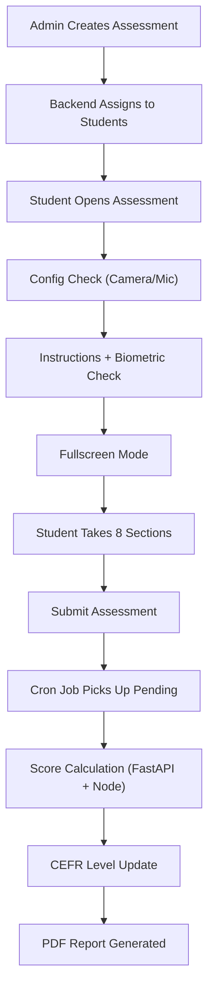

# Communication Assessment

> The Communication Assessment evaluates a student's **reading, listening, speaking, and writing** abilities using AI-powered scoring. Students are assigned a **CEFR level** (A1–C2) that adapts over time based on their performance.

---

## Overview

| Property | Value |
|---|---|
| **Assessment Type** | `Communication` |
| **CEFR Levels** | A1, A2, B1, B2, C1, C2 |
| **Domains** | Universal (default), or industry-specific |
| **Scoring Engine** | FastAPI AI Engine (Gemini/Groq + Azure Speech SDK) |
| **Report Format** | PDF (HTML-based via Handlebars) |

---

## Assessment Sections (8 Types)

| # | Section | Ability Tested | Scoring Method |
|---|---------|---------------|----------------|
| 1 | **Paragraph Reading** | Reading | Azure Speech SDK (pronunciation, fluency, completeness, prosody) + MCQ accuracy |
| 2 | **Audio Question** | Listening | MCQ-based (correct/total) |
| 3 | **Video Response** | Speaking | FastAPI AI analysis of recorded video (grammar, content, fluency) |
| 4 | **Question Based Response** | Speaking/Writing | AI evaluation of image description text (grammar, phrasing, vocabulary, coherence) |
| 5 | **Email Writing** | Writing | AI evaluation (phrasing, voice/tone, format, grammar, spelling) |
| 6 | **Dictation** | Writing | Text comparison (word accuracy, character accuracy, punctuation, capitalization) |
| 7 | **Sentence Completion** | Writing | Fill-in-the-blank correctness |
| 8 | **Sentence Build** | Writing | Drag-and-drop word ordering with normalized comparison |

---

## Final Score Weights

```
Final Score = (Video Response × 0.40)
            + (Paragraph Reading × 0.20)
            + (Audio Question × 0.10)
            + (Writing Sections × 0.30)

Writing Score = sum of present writing sections × (0.30 / 4) each
Writing Sections = Question Based Response, Sentence Completion,
                   Sentence Build, Dictation, Email Writing
```

> Not all writing sections may be present in every assessment. Score is calculated only from sections that exist.

---

## End-to-End Flow



---

## File Reference

### 1. Assessment Creation (Admin)

#### Frontend — `AssessmentSelect.js`
**Path:** `admin-react/src/modules/Assessment/Partials/CreateAssessment/AssessmentSelect.js`

- Admin selects **assessment type** = `Communication`
- Configures: name, start/end date & time, CEFR level, domain, proctoring, student list
- Supports **one-time** or **scheduled** (daily/weekly/monthly/custom) distribution
- Dispatches `assignCommunicationAssessment` action to backend

#### Backend — `Assessment.js` → `assignCommunicationAssessment()`
**Path:** `admin-node/app/models/Assessment.js` (line ~4519)

**Key steps:**
1. Fetches students via `getAssessmentAssignedParticipants()` (from bulk upload or institute data)
2. Gets each student's current **AssessmentCEFR** level from `student_personal_profile`
3. Determines CEFR level per student:
   - First-time students → use the admin-selected CEFR level
   - Returning students → use their current assessment CEFR level (adaptive)
4. Generates question sets via `generateCommunicationQuestions()` which calls FastAPI `/communication/generate_questions`
5. Creates DB records:
   - `assessmentInstituteMap` — links assessment to institute
   - `assessmentSet` — stores generated questions with CEFR level
   - `assessmentAssignedStudent` — one per student, linked to an assessment set
6. Handles **set rotation** — tracks which sets have been assigned to avoid repetition
7. Creates students in the system if they don't exist yet (auto-registration)

---

### 2. Student-Facing Frontend

**Path:** `Assessment-React/src/modules/Assessments/Partials/Communicationassmt/`

| File | Purpose |
|------|--------|
| `index.js` | Entry point — shows assessment name, deadline, **ConfigCheck** (camera/mic), Start button |
| `instruction.js` | Instructions page — runs **biometric check**, requests **fullscreen**, then navigates to assessment |
| `assessment.js` | **Main assessment UI** — renders all 8 section types, handles recording, navigation, timers, violation detection, auto-submit |
| `completion.js` | Thank-you page — shows submission confirmation, timer, navigates back |

**Key behaviors in `assessment.js`:**
- **Fullscreen enforcement** — enters fullscreen, detects violations (tab switch, right-click, copy-paste)
- **Recording** — uses MediaRecorder API for video/audio capture, uploads to OCI storage
- **Section navigation** — Next/Previous with response saving between sections
- **Auto-submit** — on timer expiry or too many violations
- **Drag-and-drop** — for Sentence Build section (uses `@dnd-kit`)
- **Anti-cheat** — blocks copy/paste, right-click, tracks fullscreen exits

---

### 3. Question Delivery (Student Backend)

#### `getCommunicationAssessmentQuestions()`
**Path:** `student-node/app/models/Assessment.js` (line ~2274)

**Key logic:**
1. Receives `assessment_set_id` and `assessment_assigned_id`
2. **CEFR level matching** — checks if the assigned set's CEFR matches the student's current `AssessmentCEFR`
   - If mismatch → queries for all active sets at the correct CEFR level, randomly picks one, updates the assignment
3. Fetches questions with sub-questions and options from the database
4. Organizes questions by section type (Paragraph Reading, Audio Question, Video Response, etc.)
5. Returns structured JSON for the frontend to render

---

### 4. Score Calculation

Scoring happens in two layers: **Node.js orchestration** and **FastAPI AI analysis**.

#### Orchestration — `CommunicationCalculations.js`
**Path:** `student-node/app/models/CommunicationCalculations.js`

| Function | What It Does |
|----------|-------------|
| `calculateParagraphReadingScore()` | Sends audio to FastAPI for speech analysis + checks MCQ answers. Combines both into overall score. |
| `calculateAudioQuestionScore()` | Pure MCQ scoring — counts correct answers out of total. |
| `calculateVideoQuestionScore()` | Sends video recordings to FastAPI for AI analysis of spoken responses. |
| `calculateQuestionBasedResponseScore()` | Sends image + text response to FastAPI for AI evaluation. |
| `calculateEmailWritingScore()` | Sends email content + prompt to FastAPI for writing quality analysis. |
| `calculateDictationScore()` | Sends user answer + reference to FastAPI for text comparison scoring. |
| `calculateSentenceCompletionScore()` | Sends fill-in-the-blank answers to FastAPI for evaluation. |
| `calculateSentenceBuildScore()` | Local scoring — normalizes and compares word order against correct answer. |
| `storeCommunicationScores()` | Stores all section scores in `communicationScores` table. Handles retakes (dedup). |

#### AI Scoring Engine — `communication.py`
**Path:** `fastapi-ai-engine/routers/communication.py`

| Endpoint | Purpose |
|----------|--------|
| `generate_questions` | Generates question sets using Gemini/Groq AI based on CEFR level and domain |
| `calculate_paragraph_reading_audio_score` | Uses **Azure Speech SDK** for pronunciation assessment — measures accuracy, completeness, fluency, prosody |
| `calculate_question_based_response_score` | AI evaluation of image description — grammar, phrasing, spelling, vocabulary, coherence |
| `calculate_email_writing_score` | AI evaluation of email — phrasing, voice/tone, format, grammar, spelling |
| `calculate_dictation_score_endpoint` | Compares user text vs reference — word accuracy, character accuracy, punctuation, capitalization |

**Speech scoring weights (Paragraph Reading):**
- Pronunciation (accuracy): 25%
- Completeness: 35%
- Fluency (pause detection): 25%
- Prosody (stress, intonation, rhythm): 15%

---

### 5. Final Score & CEFR Update

#### `CalculateFinalScore()`
**Path:** `student-node/app/models/Assessment.js` (line ~9385)

Applies weighted formula to section scores (Video 40%, Reading 20%, Audio 10%, Writing 30%).

#### `updateCurrCERFlevelOfStudent()`
**Path:** `student-node/app/models/Assessment.js` (line ~9731)

After scoring, updates the student's CEFR progression using a **rolling window of pairs** (2 assessments at the same CEFR level).

**Step-by-step process:**

1. **Get current CEFR level** from `studentPersonalProfile.AssessmentCEFR`
2. **Fetch last two uncalculated assessments** at that CEFR level (ordered by `submittedAt`)
3. **Single assessment (A1 of pair):**
   - Creates ProgressionHistory with `isSecondInPair = false`
   - Carries forward previous progression level, no NPS change
   - Marks `isCalculated = true` on this assessment only
4. **Pair complete (A1 + A2):**
   - Calculates pair average: `(finalScore1 + finalScore2) / 2`
   - NPS formula: `((CefrRankIndex × 100) + avgScore) / 6` (0–100 scale)
   - Applies **4 progression rules** (see below)
   - Creates ProgressionHistory for A2 with `isSecondInPair = true` and `suggestedCefr`
   - Updates `studentPersonalProfile.AssessmentCEFR` to `suggestedCefr`

**The 4 Progression Rules:**

| # | Condition | Result |
|---|-----------|--------|
| 1 | **Diagnosis** (first pair ever) | `newProgressionLevel = min(assessmentLevel, calculatedLevel)` — prevents inflated start |
| 2 | **Non-diagnosis, same level** as previous | `newProgressionLevel = assessmentLevel` — stay at current level |
| 3 | **Non-diagnosis, first pair at NEW level** | Confirm only if `suggestedCefr >= currentProgressionLevel` — must prove competence at new level |
| 4 | **No-downgrade rule** (all cases) | `newProgressionLevel = max(newLevel, previousProgressionLevel)` — level never drops |

**`suggestedCefr` calculation:**
- Raw suggested level comes from `getNewCERFlevel(assessmentLevel, avgScore)` mapping
- No-downgrade applied: `suggestedCefr = max(calculatedNewLevel, previousProgressionLevel)`
- Written to profile as `AssessmentCEFR` — drives next test set assignment

**Rolling Window Pair Marking:**
- Same CEFR level as previous pair → only the A1 assessment resets the pair counter
- CEFR level changed since previous pair → both A1 and A2 are marked (fresh pair at new level)

**CEFR Mapping (Assessment mode)** — `newCERFmapping.js`:

| Current Level | Score 0–85 | Score 86–100 |
|---|---|---|
| A1 | Stay A1 (0–80) | Suggest A2 (81–100) |
| A2 | Stay A2 (0–85) | Suggest B1 (86–100) |
| B1 | Stay B1 (0–85) | Suggest B2 (86–100) |
| B2 | Stay B2 (0–85) | Suggest C1 (86–100) |
| C1 | Stay C1 (0–87) | Suggest C2 (88–100) |
| C2 | Stay C2 (all) | — |

> **Key distinction:** `suggestedCefr` drives the **next test level** (written to profile). `assessmentCefr` is the **confirmed progression level** (written to ProgressionHistory). These can differ — e.g., student at A2 scores 91% → suggested=B1, progression=A2 (until confirmed at B1 level with a pair there).

**ProgressionHistory fields stored per record:**

| Field | Description |
|-------|-------------|
| `assessmentCefr` | Confirmed progression level (source of truth for "current level") |
| `suggestedCefr` | Level that drives next test assignment (only on A2 records) |
| `assessmentCefrAtTime` | Student's CEFR at the time of this assessment |
| `assessmentCommunicationProgressScore` | NPS score |
| `isSecondInPair` | `true` for A2 (pair complete), `false` for A1 |
| `pairNumber` | Pair counter |
| `pairAverageScore` | Average of the two assessments in the pair |
| `finalScore` | Individual assessment score |
| `isDiagnosis` | Whether this was a diagnosis assessment |
| `isPractice` | Practice vs assessment mode |

---

### 6. Progression & Dashboard Data Sources

#### `fetchCommunicationProgression()`
**Path:** `student-node/app/models/Assessment.js` (line ~8907)

Compares the student's **last two communication assessments** to show improvement:
- Fetches the two most recent completed assessments at the same CEFR level
- Computes per-section and per-ability deltas (Reading, Listening, Speaking, Writing)
- Calculates weighted writing scores across all writing sub-modules
- Returns progression data with before/after scores and delta indicators
- Reads confirmed CEFR from `ProgressionHistory.assessmentCefr` (not the simulative replay)

**Progression data includes:**
- CEFR level change
- Overall score change
- Per-ability score changes
- Section breakdown comparison

#### Dashboard Data Sources (TpoDashBoard.js)

| Column | Data Source | Notes |
|---|---|---|
| **Progression Level** | `ProgressionHistory.assessmentCefr` | Scoped by `assessmentAssignedId` for per-assessment views; A2 record preferred, fallback to A1 |
| **NPS (Communication)** | `ProgressionHistory.assessmentCommunicationProgressScore` | Same source as level — ensures consistency |
| **Assigned Level** | Previous `ProgressionHistory.suggestedCefr` or `assessmentSet.cefrLevel` | For non-diagnosis: uses `suggestedCefr` from previous assessment's A2 record (what actually drove the test set assignment). Falls back to `assessmentSet.cefrLevel` for diagnosis or when no previous record exists |

> **Important:** Dashboard reads progression level from `ProgressionHistory` scoped by `assessmentAssignedId` (not latest-by-email), ensuring each assessment view shows the correct level for that specific assessment. The `assignedLevel` uses the previous assessment's `suggestedCefr` because the actual CEFR set may differ from `assessmentSet.cefrLevel` due to adaptive reassignment.

#### Progression Query Scoping

When viewing a **specific assessment's** student list (`getStudentListForAssessment`), progression queries are scoped by `assessmentAssignedId` to show the level achieved on that particular assessment — not the student's latest level across all assessments.

When viewing the **total candidate list** (`getStudentListForTpoDashboard`), queries use `primaryEmail` with `orderBy: submittedAt desc` to show the student's most recent level.

This distinction prevents confusion when viewing historical assessments where a student's level was different than their current level.

---

### 7. Cron Job (Pending Score Processing)

#### `calculatePendingAssessmentCron.js`
**Path:** `student-node/script/calculatePendingAssessmentCron.js`

**Runs periodically to process submitted but un-scored assessments:**

1. **Fix inconsistent rows** — where `calculationError=true` but `scoresCalculated=true`
2. **Reset stale locks** — assessments locked for processing > 30 minutes
3. **Find ONE pending assessment** — oldest first (`submitted=true`, `scoresCalculated=false`, `isProcessing=false`)
4. **Atomic claim** — uses `updateMany` with `isProcessing: false` condition (prevents double-processing across K8s pods)
5. **Calculate score** — calls `calculateAssessmentScore()`
6. **Retry logic:**
   - Non-transient errors: max **3 attempts** → marks `calculationError=true`
   - Transient errors (timeout, 502/503/504): max **10 attempts** → retries next cycle
7. **Release lock** on success, reset attempt counter

---

### 8. PDF Report

#### Template — `communicationReport.html`
**Path:** `student-node/public/communicationReport.html`

#### Generator — `generateCommunicationReport()`
**Path:** `student-node/app/models/Assessment.js` (line ~7369)

- Uses **Handlebars** template engine to render HTML
- Converts HTML to PDF using Puppeteer
- Report includes:
  - Student info (name, age, institute)
  - Overall CEFR level
  - Ability-wise breakdown (Reading, Listening, Speaking, Writing)
  - Per-section scores with detailed metrics
  - Progression comparison (if previous assessment exists)

---

## Database Tables (Key)

| Table | Purpose |
|-------|--------|
| `assessment_type` | Stores assessment types (Communication, Aptitude, etc.) |
| `assessment_set` | Generated question sets with CEFR level and domain |
| `assessment_institute_map` | Links assessment to institute/corporate |
| `assessment_assigned_students` | Per-student assignment (tracks status, scores, attempts) |
| `communication_scores` | Individual section scores with metadata |
| `student_personal_profile` | Stores `AssessmentCEFR` and `PracticeCEFR` per student |
| `progression_history` | Stores confirmed CEFR level, NPS, pair data per assessment |
| `question` / `sub_question` / `option` | Question bank structure |
| `assessment_section` | Section definitions (Paragraph Reading, Audio Question, etc.) |

---

## Key Concepts

- **CEFR (Common European Framework of Reference)** — A1 (beginner) to C2 (mastery). Each student has a current CEFR level that adapts based on their assessment performance.
- **Assessment Sets** — Pre-generated question packs at a specific CEFR level. Multiple sets exist per level to allow rotation.
- **Set Rotation** — The system tracks which sets a student has already seen and assigns unseen ones.
- **Practice vs Assessment** — Practice assessments update `PracticeCEFR`; real assessments update `AssessmentCEFR`.
- **Proctoring** — Optional face detection during assessment (snapshots sent to FastAPI for validation).
- **Retake** — Students may retake; scores are stored separately with `isRetake` flag.
- **suggestedCefr vs newProgressionLevel** — `suggestedCefr` drives the next test level (profile update), while `newProgressionLevel` is the confirmed progression (ProgressionHistory). Dashboard always reads from ProgressionHistory for consistency.
