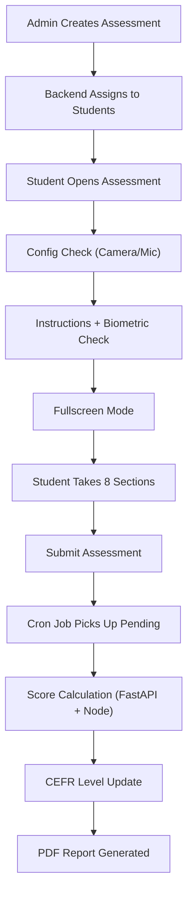

# Communication Assessment

> The Communication Assessment evaluates a student's **reading, listening, speaking, and writing** abilities using AI-powered scoring. Students are assigned a **CEFR level** (A1–C2) that adapts over time based on their performance.

---

## Overview

| Property | Value |
|---|---|
| **Assessment Type** | `Communication` |
| **CEFR Levels** | A1, A2, B1, B2, C1, C2 |
| **Domains** | Universal (default), or industry-specific |
| **Scoring Engine** | FastAPI AI Engine (Gemini/Groq + Azure Speech SDK) |
| **Report Format** | PDF (HTML-based via Handlebars) |

---

## Assessment Sections (8 Types)

| # | Section | Ability Tested | Scoring Method |
|---|---------|---------------|----------------|
| 1 | **Paragraph Reading** | Reading | Azure Speech SDK (pronunciation, fluency, completeness, prosody) + MCQ accuracy |
| 2 | **Audio Question** | Listening | MCQ-based (correct/total) |
| 3 | **Video Response** | Speaking | FastAPI AI analysis of recorded video (grammar, content, fluency) |
| 4 | **Question Based Response** | Speaking/Writing | AI evaluation of image description text (grammar, phrasing, vocabulary, coherence) |
| 5 | **Email Writing** | Writing | AI evaluation (phrasing, voice/tone, format, grammar, spelling) |
| 6 | **Dictation** | Writing | Text comparison (word accuracy, character accuracy, punctuation, capitalization) |
| 7 | **Sentence Completion** | Writing | Fill-in-the-blank correctness |
| 8 | **Sentence Build** | Writing | Drag-and-drop word ordering with normalized comparison |

---

## Duration is summed from the enabled sections (2026-08-21)

Communication persists **no duration anywhere** — there is no
`assessment_config` row for it and the wizard sends none — so the clock is
derived, in two places that must agree:

| Where | What |
|---|---|
| `admin-react-v2/src/lib/assessments/communicationSections.ts` | `communicationDurationMinutes()` — what the admin is quoted while floating |
| `student-node/app/helpers/communicationDuration.js` | same table — the candidate's actual clock, via `estimatedDuration()` in `MixMatchJourney.js` |

Each section's allowance is its own timer in the v1 candidate runner
(`Assessment-React .../Communicationassmt/assessment.js`) multiplied by the
items it carries — uniform across the question bank, so these are the real
allowance, not an estimate:

| Section | Skill | v1 timers | Budget | Whole min |
|---|---|---|---|---|
| Paragraph Reading | Reading | 150 read-aloud cap + 90 silent read + 90 for its 3 MCQs | 330s | 6 |
| Audio Question | Listening | 150 for its 6 MCQs + ~90 for the clip that plays first | 240s | 4 |
| Video Response | Speaking | 120 recording cap (60 min) | 120s | 2 |
| Question Based Response | Writing | 240 | 240s | 4 |
| Email Writing | Writing | 300 | 300s | 5 |
| Dictation | Writing | 25 × 5 sentences + ~50 for the clips | 175s | 3 |
| Sentence Completion | Writing | 25 × 5 sentences | 125s | 3 |
| Sentence Build | Writing | 180 × 2 questions | 360s | 6 |

Each section is **rounded up to a whole minute before summing** — that rounding
is what makes the full paper land on 30 rather than 28. Per skill: Reading 6,
Listening 4, Speaking 2, Writing 18 → **30 for all four**, which is exactly what
v1 hardcoded on the instruction screen (`Duration - 30 mins`). Turning skills
off now shortens the clock proportionally (Speaking alone 2 min, Listening +
Speaking 6, Reading + Listening + Writing 28).

**Email Writing and Dictation are quoted at the longer of the two (5 min).**
Delivery serves one or the other via `IsEmailWriting`, and the admin cannot see
which, so the clock is never short for whoever draws the email.

**How `IsEmailWriting` is decided** (set on the assignment row the first time
its questions are served, in `student-node` `Assessment.js`):

| Assignment | Rule |
|---|---|
| Practice | alternates on the student's practice count — even → Email Writing |
| **Diagnosis** (`is_diagnosis = true`) | takes whichever format its **sibling sitting** did not, via `app/helpers/diagnosisPair.js`. If neither has started, a stable split on the two map ids; whichever runs second then sees the sibling's stored `IsEmailWriting` and takes the opposite |
| Everything else | random, 50/50 |

> **Changed 2026-08-31.** The diagnosis rule used to match the map's **name**
> against `Assessment #1` (→ Email Writing) and `Assessment #2` (→ Dictation).
> Renaming a diagnosis float dropped **both** sittings into the random branch,
> where the pair could draw the same written format twice and the diagnosis
> would cover only one writing skill. Deriving it from the pair also makes it
> order-independent, which matters because a student can sit #2 first. Tests:
> `student-node/test/diagnosisPair.spec.js`. See
> [candidate-frontend-v2.md](candidate-frontend-v2.md) → *What counts as a
> diagnosis*.

### The `enabled_sections` trap

`enabled_sections` on `assessment_corporate_map` / `assessment_institute_map`
means **NO FILTER when empty — the whole paper** — the exact opposite of what
an empty list means to the wizard. 275 of 304 corporate maps on DEV store `[]`.
An earlier estimate read its length as a section count times 12 minutes, so the
fullest paper priced as a single 12-minute section while a Writing-only one came
to 60.

It also holds **two vocabularies**: skill groups (`Writing`) on some assignments
and granular section names (`Email Writing`) on others. The helper expands
groups before summing so both cost the same.

### v1 behaviour, for contrast

v1 admin had **no duration field for Communication at all** — `AssessmentSelect.js`
explicitly does `delete newFormData.duration` for Communication/Hinglish, and its
"Configure Sections" panel is switches only, with no time shown and no total. The
per-section timers existed solely as hardcoded literals in the candidate runner,
under a master clock of `useState(30 * 60)` that ignored which sections were on.
Hinglish is a copy of that runner with a 20-minute clock.

---

## Final Score Weights

```
Final Score = (Video Response × 0.40)
            + (Paragraph Reading × 0.20)
            + (Audio Question × 0.10)
            + (Writing Sections × 0.30)

Writing Score = sum of present writing section scores / 4
Writing Sections = Question Based Response, Sentence Completion,
                   Sentence Build, Dictation OR Email Writing
```

> An assessment has either Dictation or Email Writing (controlled by `IsEmailWriting` flag), plus up to 3 other writing sections. The divisor is always **4** (hardcoded), not the count of present sections. This ensures consistent scoring across PDF report, dashboard, and `getAssessmentReport`.

**Score consistency rule:** All display surfaces (PDF report `generateCommunicationReport`, dashboard `getStudentListForAssessment`, detail view `getAssessmentReport`) must use stored `communicationScores.score` values directly and divide writing sum by 4. Do NOT recalculate section scores from metadata — use the stored score.

---

## End-to-End Flow



## Candidate responses are mandatory (2026-08-24)

The v1 Communication runner does not allow a candidate to use **Next** or
**Submit Assessment** until the current response has genuinely been attempted.
This applies to both MCQ groups (Paragraph Reading and Audio Question), recorded
audio/video, free-text writing, Dictation, Sentence Completion, and Sentence
Build.

The guard lives in
`Assessment-React/src/modules/Assessments/Partials/Communicationassmt/assessment.js`:

- `isCurrentSectionComplete()` checks response data only. An expired section
  timer, a visited question, or section review mode no longer counts as an
  answer.
- `handleNext()` always applies that check, including when revisiting a section.
- The final Submit button applies the same check and stays disabled while the
  current question is unanswered.
- Forced submission remains available only for the overall assessment deadline
  and proctoring violations, where the candidate is no longer permitted to
  continue.

Shipped to `Development` (`493c734`) and `UAT` (`ce93d35`). The Development push
triggers the DEV deployment workflow; UAT was updated only and was not deployed.

### v2 candidate journey uses its own mandatory guard (2026-08-24 follow-up)

The `/candidate-assessment-journey/v2` route is served by the separate
`assessment-react-v2` repository. A v1-only change therefore has no effect on
that screen. In v2, `QuestionPanel` originally disabled forward navigation only
for incomplete recordings; MCQ, writing, and reorder questions could still
dispatch `NEXT`. `EXPIRE_COMMUNICATION_TIMER` also deliberately marked every
question in the timer scope visited and moved forward even when it had no
answer.

The v2 fix enforces the requirement at both UI and state-machine layers:

- Next/Finish is disabled while the current Communication answer fails
  `isAnswered()`.
- The Communication reducer refuses `NEXT` for an unanswered current question.
- Timer expiry ends the section/question timer but does not mark or advance
  unanswered questions. It advances only when every question in that timer's
  scope has a valid answer. The overall assessment deadline remains the hard
  submission cutoff.

Shipped to `assessment-react-v2` Development (`1608397`) and UAT (`470a13e`).
DEV was deployed and verified at HTTP 200; UAT was updated only and not deployed
by this change.

### v2 rail: skill order and Writing split by exercise (2026-09-01)

The `/candidate-assessment-journey/v2` rail presents Communication as the four
skills a candidate recognises, built by `groupedCommunicationSubsections`
(`src/lib/examShapes.ts`) from the API's granular section names. Two things were
wrong with how it did that.

**Order.** The groups were listed `Reading, Writing, Speaking, Listening`.
Communication is `freeNavigation: false`, so the rail order *is* the delivery
order — a candidate was made to write before they had heard the listening clips
or spoken. The fixed order is now:

| # | Rail section | API section types it groups |
|---|---|---|
| 1 | **Reading** | Paragraph Reading |
| 2 | **Listening** | Audio Question |
| 3 | **Speaking** | Video Response |
| 4 | **Writing** | Question Based Response, Email Writing, Dictation, Sentence Completion, Sentence Build |

**Writing was undifferentiated.** Writing is the only group built from more than
one exercise — up to five — so its palette rendered as one flat run of cells
(13 on a full paper) with nothing to say which was the email and which the
dictation. Each question now carries `part` (the granular section name it came
from); `questionParts()` in `src/app/_mock/exam.ts` splits a section's questions
into consecutive runs of the same `part`, and `SubsectionRail` renders one
labelled palette per run.

Rules worth knowing:

- **Numbering stays continuous across the parts** (Sentence Build 1–2, Question
  Based Response 3, Email Writing 4, …). The palette, the `n/N` on the rail head
  and the `Question X of Y` breadcrumb all read from `numberedQuestions()`, so
  they cannot disagree.
- A section made of a **single** exercise renders one *unlabelled* palette — i.e.
  Reading, Listening, Speaking and every non-Communication assessment look
  exactly as before.
- Adjacent runs of the same exercise merge into one labelled block, so two
  consecutive Dictation sections do not render as two identical headings.
- Nothing about save/submit changed: each question keeps its `live.sectionKey`
  (`paragraphReading`, `emailWriting`, …), which is what the API buckets on. The
  per-exercise timers in `communicationTimers.ts` key off the answer surface
  (`writingMode` / `communicationMode`), not display copy, so they are unaffected
  by either the reorder or the labels.

Shipped to `assessment-react-v2` Development (`e6fd99a`) and UAT (`e0af495`).
Both DEV and UAT were deployed and verified — no DEV URLs in the UAT bundle, no
page errors on load.

---

## File Reference

### 1. Assessment Creation (Admin)

#### Frontend — `AssessmentSelect.js`
**Path:** `admin-react/src/modules/Assessment/Partials/CreateAssessment/AssessmentSelect.js`

- Admin selects **assessment type** = `Communication`
- Configures: name, start/end date & time, CEFR level, domain, proctoring, student list
- Supports **one-time** or **scheduled** (daily/weekly/monthly/custom) distribution
- Select **Listening Audio Accent** (default `en-IN` Indian English; other options: `en-US`, `en-GB`, `en-AU`). Default keeps the existing shared set pool; a non-default accent is served from that accent's own pool if a usable set already exists, otherwise a fresh set is generated **on the assignment queue** (see *Queued accent/topic set generation* below) (voices in `ACCENT_VOICES`, `QuestionGeneration/Communication/audio_generation_google.py`: `en-IN`→`en-IN-Chirp-HD-O`, `en-US`→`en-US-Chirp3-HD-Kore` (upgraded from `en-US-Wavenet-F` on 2026-07-24 for a more natural US female voice), `en-GB`→`en-GB-Wavenet-F`, `en-AU`→`en-AU-Wavenet-C`). Applies to **both institute and corporate** creates.
- Dispatches `assignCommunicationAssessment` action to backend
> **Accent was dropped at TWO gates (both fixed 2026-07-24) — declare it everywhere or it silently falls back to en-IN.** The selected non-`en-IN` accent (symptom: US assessment plays `en-IN-Chirp-HD-O`; DB shows the assign bound a shared en-IN pool set and `assessment_assignment_jobs.config_snapshot.prepare.specs.main.accent = "en-IN"`) was being lost at two independent points:
> 1. **admin-react whitelist** — `createAssessments` → `filterAssessmentData()` (`src/modules/Assessment/actions.js`) rebuilds each assign payload from a **field whitelist**; the `Communication` branch omitted `accent`. Fix: added `accent: assessment.accent || 'en-IN'`.
> 2. **admin-node Fastify schema (the deeper one)** — `POST /assessment/assignAssessment` uses `assignAssessmentSchema` (`admin-node/app/schemas/assessment.js`), whose body has **`additionalProperties: false`** but never declared `accent`. Fastify therefore **strips `accent` from `request.body` before the handler runs**, so even a correct `accent:"en-US"` payload arrived as `undefined` → `normalizeAccent("")` → `en-IN`. Fix: declared `accent` (`enum en-IN/en-US/en-GB/en-AU`, default en-IN) in the schema — note there are **two duplicate `exports.assignAssessmentSchema`** (line ~754 dead, ~1254 effective); patched both. **Lesson:** any new field on a Fastify route with `additionalProperties:false` must be added to the schema or it's silently dropped — the admin-react change alone was necessary but not sufficient.
>
> The backend assign flow + async queue were themselves accent-correct once the value arrives; `ASSIGNMENT_ASYNC_ENABLED=1`. Both fixes deployed DEV + UAT. **Gotcha when testing:** reusing an existing assessment **name** (`create:false`) just appends the candidate to the existing (already-en-IN) assessment set — use a brand-new name to trigger generation. *(Historically `assignCommunicationAssessmentAsync` materialized the non-default-accent set inline before creating the job; since 2026-07-31 it emits a prepare-set spec instead — see below.)*
> **Known gap (NOT yet fixed) — delivery-time set-swaps are accent-blind.** `student-node getCommunicationAssessmentQuestions` has **three** set-swap queries (CEFR-from-progression, CEFR-from-profile, and the malformed-set **validation swap**) that filter only on `cefrLevel + assessmentTypeId + assessmentDomainId + isActive` — **never `accent`** (student-node has zero `accent` references). When any swap fires it picks a random set from the ~99% `en-IN` pool, silently reverting a freshly-generated `en-US`/`en-GB`/`en-AU` set to Indian at start time. The two CEFR swaps are gated on `!isOneTime && is_institute` (so they hit **institute-scheduled** only); the **validation swap is ungated → it also swaps one-time *and* corporate** papers across accents. Fix pending: accent-scope all three `assessmentSet.findMany` where-clauses.

#### Queued accent/topic set generation (2026-07-31, DEV + UAT)

A Communication assign **generates** a set whenever the pool can't serve the requested configuration — a **non-default listening accent**, a **free-text topic** (a topic that isn't a registered `assessment_domain`, which resolves `domainId` to `Universal`), or simply **no complete set at the requested CEFR level** in that accent's pool. Everything else is pool-picked.

That generation used to run **inline inside the admin's assign HTTP request**, before the job row existed: an LLM call plus Google TTS for the whole set. The request blocked for the entire generation, no progress was visible anywhere, and any failure became a bare 500 with nothing to retry.

It now runs on the **existing `assessment-prepare-set` stage** of the assignment queue, the same machinery role-based set generation uses:

- `admin-node/app/models/Assessment.js` → `assignCommunicationAssessmentAsync` emits a spec instead of materializing. Only **pre-generated questions from the UI preview** are still materialized inline (they're already in hand — a DB write, no LLM call).
- Generator kinds registered in `admin-node/app/queues/setGenerators/communicationSetGenerator.js` — **all four are pick-or-generate** since 2026-08-17:
  - `communication-main` / `communication-generate` → one set
  - `communication-diagnosis` / `communication-generate-diagnosis` → two distinct sets
  - The `-generate` names are kept only to mark requests where generation was near-certain up front (free-text topic / non-default accent) so the progress UI can say so, and so in-flight jobs keep resolving. They no longer mean "the other kinds refuse to generate" — `communication-main` was pool-pick-only until 2026-08-17 and would throw *"top up the pool"* on a total miss.
- The job sits in state **`preparing`** until the prepare-set barrier completes, then `orchestrate` resumes and fans items out. **No invite email goes out before the set is bound.**
- Failures now retry via BullMQ, and `assignmentRecovery` resumes a job stuck in `preparing` (re-dispatching only still-missing specs).

**Three guarantees enforced before an existing set is reused** (`pickCompleteSet` → `buildPoolWhere`, `admin-node/app/helpers/communicationSetSelection.js`):

1. **Pitched at the requested CEFR level** — the pool filter *always* carries `cefrLevel`, so a miss is a miss and the caller generates at that level. It is never widened to "any level". A set is pitched **at** a level and a candidate's reported band can never exceed it, so binding a B1 request to an A2 set silently caps every result at A2.

   > **PROD incident, 2026-08-17 — 25 corporate candidates issued an A2 paper on a B1 request.** A KNACK RCM assign requested **B1 + `en-US`**. The `en-US` pool held two B1 sets (`f27e8a34…`, `de9082f0…`, generated 24/30 Jul) but **both were missing every Writing sub-section**, so `filterCompleteAssessmentSets` rejected them. `pickCompleteSet` then re-ran the lookup **without** the CEFR filter and bound the newest complete `en-US` set — which was **A2**. `assessment_assignment_jobs.config_snapshot.prepare.specs.main.cefrLevel` read `"B1"` while `sets.main` pointed at the A2 set, so the job row is the fastest way to spot this. The same fallback hit a second map the same day (37 candidates, also B1). Fixed by removing the widening query; the 25 candidates were rebound to a freshly generated complete B1/`en-US` set before the window opened. **The two incomplete July `en-US` B1 sets are still `is_active = true` on PROD and should be deactivated** — they can never be picked for a full assessment, they only ever caused the fallback.

2. **Covers every required section** — via `findFirstCompleteAssessmentSet` → `filterCompleteAssessmentSets`, which requires every enabled section group to be present. A **freshly generated** set is now checked the same way (`assertCoversRequiredSections`); a short LLM response throws so the prepare-set job retries rather than binding an assessment missing a whole skill group.

   > **UAT media incident, 2026-08-27:** set `1d852cbe-4b98-4e04-9769-98de938a295a` structurally contained all eight Communication sections, but its Listening question referenced `audio/google_audio_20260823000225_687698_135035c2.mp3`, which was absent from the `pl-uat-assessment` bucket. Candidate delivery therefore received a null audio URL and assessment-react-v2 removed the media-less Audio Question, making the entire Listening tab disappear. The same set was reused for `prabha+ndwiokdkio@pluginlive.com` on `comm side bar check - Communication`, reproducing the symptom. The set was deactivated on UAT (`assessment.assessment_sets.is_active=false`) to prevent future pool selection. Deactivation does not rewrite existing `assessment_assigned_students` links; affected candidates must be reassigned/retriggered onto a healthy set.

3. **Not already sat by this cohort** — set ids already assigned to any candidate in this assign are excluded. This was previously `primaryEmail: { in: studentEmails }`, which is **exact-case in Prisma**, against a column that genuinely holds mixed-case addresses (rosters re-uploaded with different casing). Verified on DEV: for a stored `jenijef420+Rolebased1tym@gmail.com` the exact-case filter matched **0** rows against the lowercased roster value, so a candidate could be handed a set they had already sat. Now one indexed `lower(primary_email) = ANY(...)` lookup collects the seen set ids and excludes them — also cheaper than an N-clause insensitive OR for a large cohort. **This fix also hardens the pre-existing `communication-main`/`communication-diagnosis` pool-pick paths, which had the same hole.**

**Reuse:** generated sets are stored with their `accent` and `cefr_level` and land in that accent's own pool, so a second assign at the **same accent *and* level** reuses the first's set instead of paying for another LLM + TTS run — while a different level generates rather than substituting. A **free-text topic never reuses** — its `domainId` fell back to `Universal`, so pool-picking would silently drop the admin's topic.

Because every kind can now generate, the spec built in `assignCommunicationAssessmentAsync` always carries `topic`, `isFreeTextTopic` and `createdBy` (previously only the `-generate` kinds did). Without `topic`, a generating `communication-main` for a registered non-Universal domain would produce Universal content stored under that domain's id.

**Diagnosis pair** now gets **two distinct sets**. The old inline path bound the *same* materialized set to both Assessment #1 and #2, making the second sitting a re-run of the first.

**Progress UI:** `getJobProgress` returns a derived `prepare: { total, ready, pending, isGenerating, accent, topic }` (null when the job needed no preparation). The submit-and-go modal (`AssignmentProgressModal`) and the Activity view render it as its own phase — "Generating question sets", sets-ready count, topic + accent — so a `preparing` job no longer reads as a stalled 0/N.

**Timeout:** `FastAPIService.generateCommunicationQuestions` had **no axios timeout**. Inline that blocked one request; on the concurrency-8 prepare-set worker an unbounded wait would pin a slot indefinitely instead of failing into retry. Now bounded to `300000` like its sibling.

> **Note:** the admin-react "Generate Test" **preview** endpoint (`POST /assessment/generateTopicBasedQuestions`) is still synchronous — see the nginx 900s timeout note below. Only the **assign** path was queued.

#### Backend — `Assessment.js` → `assignCommunicationAssessment()`
**Path:** `admin-node/app/models/Assessment.js` (line ~4519)

**Key steps:**
1. Fetches students via `getAssessmentAssignedParticipants()` (from bulk upload or institute data)
2. **Determines CEFR level per student using `suggestedCefr` from `progression_history`:**
   - Queries `progression_history` for the latest `suggested_cefr` (non-null) per student email, filtered by `is_practice = false`
   - Uses raw SQL with `DISTINCT ON (LOWER(primary_email))` ordered by `submitted_at DESC`
   - First-time students (no progression record) → use the admin-selected CEFR level
   - Returning students → use `suggestedCefr` from their latest progression record
   - **One-time assessments (`assessment_institute_map.is_one_time = true`) are excluded** — they always keep the admin-selected CEFR level (see below)
> **One-time assessments never have their CEFR set swapped.** At delivery time `getCommunicationAssessmentQuestions` (`student-node/app/models/Assessment.js`) re-checks the assigned set's CEFR against the student's history and swaps the set in **two** places: from `progression_history.suggested_cefr` when the student has 2+ entries, and from the `student_personal_profile` CEFR fallback (`AssessmentCEFR` / `PracticeCEFR`) when they have fewer. Both are gated on `assessmentInstituteMap.isOneTime` — a one-time paper is standalone and must serve the CEFR level it was assigned. Fixed 2026-07-16 alongside the equivalent Aptitude gate (see `Assessment/aptitude.md`).

3. Generates question sets via `generateCommunicationQuestions()` which calls FastAPI `/communication/generate-questions` with the admin-selected `accent`
4. Creates DB records:
   - `assessmentInstituteMap` — links assessment to institute
   - `assessmentSet` — stores generated questions with CEFR level and the `accent` the listening/dictation audio was generated with
   - `assessmentAssignedStudent` — one per student, linked to an assessment set
5. Handles **set rotation** — tracks which sets have been assigned to avoid repetition
6. Creates students in the system if they don't exist yet (auto-registration)

#### Practice Assignment — `assignPracticeAssessmentCommunication()`
**Path:** `admin-node/app/models/Assessment.js`

Same flow as above but queries `progression_history` with `is_practice = true` for the latest `suggested_cefr`. Falls back to `practice_cefr` from `student_personal_profile` if no progression record exists.

> **Important:** Both practice and non-practice assignment use `suggestedCefr` from `progression_history` (not from `student_personal_profile`) to determine the CEFR level for question generation. This ensures the assigned level always reflects the latest progression-derived recommendation.

---

### 2. Student-Facing Frontend

**Path:** `Assessment-React/src/modules/Assessments/Partials/Communicationassmt/`

| File | Purpose |
|------|--------|
| `index.js` | Entry point — shows assessment name, deadline, **ConfigCheck** (camera/mic), Start button |
| `instruction.js` | Instructions page — runs **biometric check**, requests **fullscreen**, then navigates to assessment |
| `assessment.js` | **Main assessment UI** — renders all 8 section types, handles recording, navigation, timers, violation detection, auto-submit |
| `completion.js` | Thank-you page — shows submission confirmation, timer, navigates back |

**Key behaviors in `assessment.js`:**
- **Fullscreen enforcement** — enters fullscreen, detects violations (tab switch, right-click, copy-paste)
- **Recording** — uses MediaRecorder API for video/audio capture, uploads to OCI storage
- **Section navigation** — Next/Previous with response saving between sections. A sticky "Section completed → continue" banner (`SectionCompleteBar` / `SectionCompleteMessage`) lives on `Development` (commit `d1a64cc` + hotfix `59c504f`). It was once "reverted on UAT only" (`1334753`), but that revert was **incomplete**: it dropped the two styled exports from `Style/index.js` while `assessment.js` kept importing and rendering them. That inconsistency lay dormant (the live bundle predated it) until a rebuild on 2026-07-14 baked it in, making `<SectionCompleteBar>` resolve to `undefined` → **`Minified React error #130`** the moment any section was marked complete (e.g. after answering the Paragraph Reading questions). **Fixed on UAT `15e8e7f` (2026-07-14)** by restoring the two exports so UAT matches `Development` — the sticky bar now renders on UAT again. Lesson: a "UAT-only revert" of a component must remove the export **and** every import/usage together, or a later Development→UAT merge re-introduces the usage against a missing export.
- **Recording countdown + section-transition dialog — RE-SHIPPED (corporate-gated) on UAT `290bdca`, 2026-07-14.** After an earlier always-on version was reverted (UAT `e86971f`), the two cues were rebuilt **gated on `isCorporateAssessment()`** so only **corporate** Communication takers see them; institute/student flows are unchanged. Both cues live in `Communicationassmt/assessment.js` **and** the Hinglish fork `Hinglishassmt/assessment.js`:
  - **3-2-1 pre-recording countdown** — clicking **Record** in **Paragraph Reading** or **Video Response** runs a full-screen `3…2…1` overlay ("Recording starts in", with section-aware guidance copy) via `startWithCountdown(startFn)` before the real `startAudioRecording`/`startRecording` fires. `data-testid="record-countdown-overlay"`.
  - **Section-transition loader** — on a **real** section change (`handleNext`), a white dialog ("Please wait → Taking you to the next section → *<Ability>*") with the section's ability icon (`getSectionIcon`) + a spinning arc shows for **1.5s**, then `advanceToNextSection()` runs. The page advance is **deferred** until the dialog closes so the next section's timers don't start under the cover. Intra-section navigation in the multi-question writing sub-types (Dictation / Sentence Completion / Sentence Build) returns *before* this block, so the loader never fires between questions within a section. `data-testid="next-section-loader"`.
  - **Corporate detection** is resilient across entry paths: `isCorporate` is seeded on the portal (`DirectAssessment.js`, from `matchingAssessment.isCorporate`) and the OTP-invite flow (`InviteAssessmentRunner.js`, always `true`), with a `studentCorporateStatus.isCorporate` redux fallback. `isCorporateAssessment()` accepts boolean or string `'true'` on `currentAssessment` / `assessment` / `assessmentData`.
  - PROD: pending (UAT only as of 2026-07-14).
- **⚠️ Separate Hinglish fork** — corporate Communication with `response_language` = Hindi/Hinglish renders through `Assessment-React/.../Hinglishassmt/assessment.js`, a near-duplicate of `Communicationassmt/assessment.js`. **Any student-facing Communication UI change must be applied to BOTH files** or it silently won't appear for Hinglish-language corporate takers. (The corporate countdown + section loader above are already in both.)
- **Auto-submit** — on timer expiry or too many violations
- **Drag-and-drop** — for Sentence Build section (uses `@dnd-kit`)
- **Anti-cheat** — blocks copy/paste, right-click, tracks fullscreen exits

---

### 3. Question Delivery (Student Backend)

#### `getCommunicationAssessmentQuestions()`
**Path:** `student-node/app/models/Assessment.js` (line ~2262)

**Key logic:**
1. Receives `assessment_set_id` and `assessment_assigned_id`
2. **CEFR level correction at delivery time** (institute assessments only):
   - Queries `progression_history` for the student's latest `suggestedCefr` (non-null), using the `isPractice` flag from the assignment
   - If the student has prior progression records, checks whether the assigned set's CEFR matches `suggestedCefr`
   - If mismatch → queries for all active sets at the correct CEFR level, randomly picks one, updates the assignment
   - This handles the case where a student's level changed between assignment and delivery
3. Fetches questions with sub-questions and options from the database
4. Organizes questions by section type (Paragraph Reading, Audio Question, Video Response, etc.)
5. Returns structured JSON for the frontend to render

---

### 4. Score Calculation

Scoring happens in two layers: **Node.js orchestration** and **FastAPI AI analysis**.

#### Orchestration — `CommunicationCalculations.js`
**Path:** `student-node/app/models/CommunicationCalculations.js`

| Function | What It Does |
|----------|-------------|
| `calculateParagraphReadingScore()` | Sends audio to FastAPI for speech analysis + checks MCQ answers. Combines both into overall score. |
| `calculateAudioQuestionScore()` | Pure MCQ scoring — counts correct answers out of total. |
| `calculateVideoQuestionScore()` | Sends video recordings to FastAPI for AI analysis of spoken responses. |
| `calculateQuestionBasedResponseScore()` | Sends image + text response to FastAPI for AI evaluation. |
| `calculateEmailWritingScore()` | Sends email content + prompt to FastAPI for writing quality analysis. |
| `calculateDictationScore()` | Sends user answer + reference to FastAPI for text comparison scoring. |
| `calculateSentenceCompletionScore()` | Sends fill-in-the-blank answers to FastAPI for evaluation. |
| `calculateSentenceBuildScore()` | Local scoring — normalizes and compares word order against correct answer. |
| `storeCommunicationScores()` | Stores all section scores in `communicationScores` table. Handles retakes (dedup). |

#### Speaking STT — Language Routing (`responseLanguage`)

Spoken sections (chiefly **Video Response**) route to different STT engines based on the assignment's **response language**:

- **English → Deepgram** (`/communication/calculate-video-question-score`).
- **Non-English → Deepgram nova-3** via the `/hinglish/*` endpoints (`fastapi-ai-engine/routers/hinglish.py::transcribe_with_deepgram`). A `DEEPGRAM_LANGUAGE_CODE_MAP` maps the response language to a nova-3 language code: **Hindi & Hinglish → `hi`** (nova-3 handles Hindi/English code-switching natively; output in Devanagari), Tamil → `ta`, Telugu → `te`, Kannada → `kn`, Bengali → `bn`, Marathi → `mr`, Gujarati → `gu`, English → `en`. Any language without a dedicated nova-3 model (e.g. Malayalam, Punjabi, Odia, Assamese, Urdu) falls back to nova-3 **multilingual auto-detect** (`language=multi`). Audio is normalized to 16 kHz mono WAV (pydub) and sent to the Deepgram prerecorded REST API in a single call. *(Migrated from Sarvam AI → Deepgram on 2026-06-18 so the multilanguage Communication flow uses the same STT engine as AI Interview. Endpoint paths, request params and response shapes were unchanged.)*

**Language resolution (map only).** `responseLanguage` is resolved in `student-node/app/models/Assessment.js` — in both `getAssessmentQuestions()` and `calculateAssessmentScore()` — from the **per-assignment map only**:

```
corporateMap.response_language  →  instituteMap.response_language  →  English
```

- The **map** (`assessment_corporate_map` / `assessment_institute_map`) is the single source of truth. **Language selection is a corporate-side option only** — the **institute** side has no language picker, so institute Communication assignments are **always English** and their `assessment_institute_map.response_language` is **always NULL**.
- **A NULL map ⇒ English.** `assessment_sets.response_language` is **never consulted** (sets are reused/stale across languages — e.g. an institute assignment may sit on a Hinglish-tagged set even though the institute never chose a language). This holds for **all** types, including legacy `hinglish`-type.
- **Prior bug (fixed):** the old code fell back to the set, so an English answer on an institute Communication assignment sitting on a Hinglish set was mis-routed to the Hinglish STT path and scored **0**.

> **Infra note (generation-timing):** non-default-accent (`en-US`/`en-GB`/`en-AU`) set generation runs **inline in `POST /assessment/generateTopicBasedQuestions`** (admin-react "Generate Test" → admin-node → FastAPI `/hinglish/generate-questions`), and en-US Chirp3-HD TTS for the whole set can take well over a minute. On `api-admin.uat.pluginlive.com` this endpoint had **no dedicated nginx `location` block**, so it fell through the catch-all `location /` (no proxy timeouts → default **60s**) and returned a **504** mid-generation. Fixed 2026-07-24 by adding `location /assessment/generateTopicBasedQuestions` (+ alias `/assessment/generateHinglishQuestions`) with `proxy_connect/send/read_timeout 900; send_timeout 900;` — mirroring the existing `/aptitude/generate-questions`, `/assessment/generateRoleBasedQuestions`, `/ai-interview/` blocks. **Downstream ceiling stays ~5 min:** admin-node→FastAPI axios timeout is `300000` (`admin-node/app/service/FastAPIService.js`) and `fast-api.uat` `location /hinglish/` is `300s`; if whole-set gen ever exceeds 5 min those two must be bumped too. (Old `admin-node.conf.bak.*` copies were moved out of `sites-enabled` into `/etc/nginx/conf-backups/` to stop them loading as duplicate `server` blocks.)

> **Infra note:** the `/hinglish/*` FastAPI routes had no nginx `location` block on `fast-api.uat.pluginlive.com`, so they used the default 60s `proxy_read_timeout`. Long-audio STT could exceed that, causing a **504** that student-node swallowed and persisted as a real `0`. Fixed by adding `location /hinglish/ { proxy_read_timeout 300; … }` (PROD's k8s ingress already applies 300s via its catch-all). The 300s safeguard is retained after the Deepgram migration. *(Historically this was the Sarvam batch-STT path, which took ~3 min for audio > 30s; Deepgram prerecorded is a single, generally faster call, but the timeout headroom is kept.)*

#### AI Scoring Engine — `communication.py`
**Path:** `fastapi-ai-engine/routers/communication.py`

| Endpoint | Purpose |
|----------|--------|
| `generate_questions` | Generates question sets using Gemini/Groq AI based on CEFR level, domain, and the admin-selected `accent`. Default `accent=en-IN` keeps Indian-context scenarios and the existing shared set pool. Any other accent (`en-US`, `en-GB`, `en-AU`) generates a **fresh** set with culturally-neutral content and uses Google Cloud TTS voices for the Audio Question and Dictation audio (`en-US` → **`en-US-Chirp3-HD-Kore`** since 2026-07-24, `en-GB`/`en-AU` → Wavenet). Chirp3-HD is Google's newest tier — no SSML, plain-text only, slightly higher latency than Wavenet (less pressing since 2026-07-31: assign-time generation moved to the `assessment-prepare-set` queue stage — see *Queued accent/topic set generation*; the **preview** endpoint is still inline). **Since 2026-07-31 set generation runs on `gemini-3-flash-preview`**, not `gemini-2.5-pro`, via a `SET_GENERATION_MODEL` constant in `routers/hinglish.py` + `routers/communication.py` (env-overridable, so a gateway model-group rename is a config flip). Verified on DEV and UAT against the real prompt: all 8 sections, valid JSON, correct sub-question counts, ~18s vs ~27s on Pro. **Scoring stays on `gemini-2.5-pro`** — those prompts are tuned for Pro. **The model-group name matters:** bare `gemini-3-flash` 404s and `gemini-3.5-flash` was never a group at all (see `routers/ai_interview.py`); a bad name has no fallback so every generation 500s. Confirm the group exists per-environment (`GET {LITELLM_PROXY_URL}/models`) before promoting. Set selection/rotation is scoped by `accent` so pools never mix. **Question Based Response** sections need an AI image: `QuestionGeneration/Communication/image_generation_google.py` generates it via **Imagen** and uploads to student-node. Image gen routes through the **LiteLLM gateway** (`gemini/imagen-4.0-fast-generate-001`, tracked) when `LITELLM_PROXY_URL`+`LITELLM_VIRTUAL_KEY` are set, else native `google.genai`. If image gen fails, the **entire** set generation aborts with *"Assessment cannot be generated right now. Image generation failed…"*. See `Infrastructure/ai-gateway.md`. |
| `calculate_paragraph_reading_audio_score` | Uses **Azure Speech SDK** for pronunciation assessment — measures accuracy, completeness, fluency, prosody |
| `calculate_question_based_response_score` | AI evaluation of image description — grammar, phrasing, spelling, vocabulary, coherence |
| `calculate_email_writing_score` | AI evaluation of email — phrasing, voice/tone, format, grammar, spelling |
| `calculate_dictation_score_endpoint` | Compares user text vs reference — word accuracy, character accuracy, punctuation, capitalization |

**Speech scoring weights (Paragraph Reading):**
- Pronunciation (accuracy): 25%
- Completeness: 35%
- Fluency (pause detection): 25%
- Prosody (stress, intonation, rhythm): 15%

---

### 5. Final Score & CEFR Update

#### `CalculateFinalScore()`
**Path:** `student-node/app/models/Assessment.js` (line ~9557)

Applies weighted formula to section scores (Video 40%, Reading 20%, Audio 10%, Writing 30%).

#### `updateCurrCERFlevelOfStudent()` → `replayCommunicationProgression()`
**Path:** `student-node/app/models/Assessment.js`; pure core in `student-node/app/helpers/communicationProgression.js`

After scoring, the student's **entire** Communication chain (for one `is_practice` value) is recomputed deterministically and every `progression_history` row is re-upserted. The live path (`updateCurrCERFlevelOfStudent` → `replayCommunicationProgression`) and the **backfill** (`CommunicationCalculations.backfillAllStudentProgression`) call the **same pure core** (`computeCommunicationChain`), so they can never diverge. This replaced the old "rolling window of pairs" + `is_calc` machinery, which let the live and backfill paths drift apart (causing missing/stale latest CEFR in the frontend and the need for repeated manual backfills).

**Model — each row is derived from its assessment and its immediate predecessor:**
- The **first two** assessments are the **diagnosis**.
- `avg = (total_predecessor + total_current) / 2`.
- If the current assessment's **set CEFR level equals the predecessor's**, the pair **derives** a new level; otherwise the row **carries forward** the predecessor's `progression`/`suggested` (and waits for a same-level partner).
- There is **no `is_calc` / consume / clean-break bookkeeping** — every row simply looks back one assessment.
- **Scores are reused, not recomputed.** `_scoreCommunicationChain` reuses each assessment's `final_score` already stored in `progression_history` and only (re)scores the assessment that triggered the replay (or any with no stored score yet). Final scores are stable, so this keeps a full-chain replay at O(N) reads + ~1 score computation. **Gotcha:** re-scoring an *old* assessment alone won't change its progression row unless that assessment is the trigger — run the backfill (scoped to the email) to force a full re-derive.

**Level derivation (`deriveCommunicationLevels`):**

```
newLevel    = getNewCERFlevel(setLevel, avg, isPractice, isDiagnosis)
suggested   = newLevel
```

| Phase | Mapping used | progression |
|---|---|---|
| **Diagnosis** (first 2) | `cerfMapping` (detailed bands; downgrade allowed for calibration) | `= suggested`, **except** `C2 → C1` (C2 means "suggest C2 test", not a confirmed level) |
| **Post-diagnosis** | `assessmentCefrMapping` (stay-or-up) | `= one rank below suggested` (floor A1) |

- **No-downgrade** (assessment chains, post-diagnosis only): `suggested = max(suggested, prevSuggested)`, `progression = max(progression, prevProgression)`. Because `previousSuggested` is null only at the diagnosis pair, downgrade is automatically allowed there and blocked afterward.
- **Practice chains** skip the no-downgrade clamp — practice **may drift down** to always reflect the latest mapped level.

**The diagnosis→post-diagnosis seam:** diagnosis seeds `progression = suggested`; post-diagnosis wants `progression = suggested − 1`. No-downgrade absorbs the gap, so a student confirmed at e.g. A2 by diagnosis **stays** at A2 and only ever ratchets **up** when a same-level pair scores ≥86.

**NPS** — one formula, anchored at each half's own confirmed level (auto-bridges on a level change):

```
NPS(row) = avg( communicationNPS(progression_predecessor, total_predecessor),
                communicationNPS(progression_current,     total_current) )
```
where `communicationNPS(level, score) = (rankIndex × 100 + score) / 6` (A1=0 … C2=5). When the predecessor has no progression yet (diagnosis #1), both halves anchor at the current progression.

This is the **linear, stored** value. Since 2026-08-25 every *display* surface curves it at read time (`NPS_CURVATURE_K`, default `k=4`), which moves the visible band edges to A1 `0–31.74` · A2 `31.74–52.65` · B1 `52.65–68.26` · B2 `68.26–80.73` · C1 `80.73–91.11` · C2 `91.11–100`. The progression algorithm itself is bit-for-bit unchanged — the bridge above still averages *linear* values. See [nps-scale-and-curve.md](nps-scale-and-curve.md).

**Diagnosis #1 stores `nps: null` (and `assessment_cefr: null`) on purpose** — there is no predecessor and no confirmed level to anchor on. On UAT that is **104 of 189 scored rows, i.e. 48% of Communication students, with no NPS at all**. They are invisible to every NPS-based average, not merely under-weighted, so any cohort NPS must be shown with its `n`. Aptitude has no equivalent gap (it backfills both halves at `diagnosis_number = 2`).

**Worked example (set levels B1,B1,A2,A2,A2,B1,B1; non-practice):**

| # | set | score | progression | suggested | note |
|---|---|---|---|---|---|
| 1 | B1 | 60 | null | null | diagnosis #1 (no predecessor) |
| 2 | B1 | 78 | A2 | A2 | diagnosis #2 (cerfMapping; prog = sugg) |
| 3 | A2 | 82 | A2 | A2 | carry (set shifted B1→A2) |
| 4 | A2 | 80 | A2 | A2 | derive **stay** (no-downgrade holds A2) |
| 5 | A2 | 94 | A2 | B1 | derive **move-up** (suggested↑, prog held) |
| 6 | B1 | 78 | A2 | B1 | carry at new level |
| 7 | B1 | 98 | B1 | B2 | derive move-up → **prog A2→B1, bridge NPS** |

> **C2 ceiling:** post-diagnosis `progression = suggested − 1` caps confirmed progression at **C1** (a student tested at C2 keeps progression C1). Only the diagnosis can confirm via the cerfMapping bands.

**Profile update (`_updateProfileCefr`, keyed by `primaryEmail`):** from the latest row's `suggestedCefr` — first-timer seeds `PracticeCEFR`/`AssessmentCEFR`/`MaxPracticeCEFR`; practice updates `PracticeCEFR` (+`MaxPracticeCEFR` if higher); non-practice updates `AssessmentCEFR` (drives next-test assignment). The triggering assessment's `resultingCefr` is also stamped with its suggested level.

> **Key distinction:** `suggestedCefr` drives the **next test level** (profile `AssessmentCEFR`). `assessmentCefr`/`practiceCefr` is the **confirmed progression level** read by the frontend/report (`getAllAssessmentScores` reads `progression_history.assessmentCefr` per assessment and skips nulls). They differ by one rank post-diagnosis (e.g. confirmed A2, suggested B1).

**ProgressionHistory fields stored per record:**

| Field | Description |
|-------|-------------|
| `assessmentCefr` / `practiceCefr` | Confirmed progression level (source of truth for "current level"); one written per `isPractice` |
| `suggestedCefr` | Next-test level; null only on the very first assessment of the chain |
| `assessmentCefrAtTime` | Set CEFR level this assessment was taken at |
| `assessmentCommunicationProgressScore` / `practiceCommunicationProgressScore` | NPS (0–100) |
| `isSecondInPair` | `true` for every row that completed a pair with its predecessor; `false` only for diagnosis #1 |
| `isDiagnosis` | `true` for the first two assessments |
| `pairNumber` | Position in the chain (informational; no consumer reads it) |
| `pairAverageScore` | `(total_predecessor + total_current)/2` |
| `finalScore` | Individual assessment score |
| `isPractice` | Practice vs assessment chain |

> **`is_calc` is no longer used** by progression. The old `fetchLastTwoComunnicationAssessments` and `markAssessmentAsCalculated` helpers are dead (no callers); the column is left intact but read by nothing in the communication flow.

---

### 6. Progression & Dashboard Data Sources

#### `fetchCommunicationProgression()`
**Path:** `student-node/app/models/Assessment.js` (line ~9050)

Compares the student's **last two communication assessments** to show improvement:
- Fetches the two most recent completed assessments at the same CEFR level
- Computes per-section and per-ability deltas (Reading, Listening, Speaking, Writing)
- Calculates weighted writing scores across all writing sub-modules
- Returns progression data with before/after scores and delta indicators
- Reads confirmed CEFR from `ProgressionHistory.assessmentCefr` (not the simulative replay)

**Progression data includes:**
- CEFR level change
- Overall score change
- Per-ability score changes
- Section breakdown comparison

#### Dashboard Data Sources (TpoDashBoard.js)

| Column | Data Source | Notes |
|---|---|---|
| **Progression Level** | `ProgressionHistory.assessmentCefr` | Scoped by `assessmentAssignedId` for per-assessment views; A2 record preferred, fallback to A1 |
| **NPS (Communication)** | `ProgressionHistory.assessmentCommunicationProgressScore` | Same source as level — ensures consistency |
| **Assigned Level** | **One-time map → `assessmentSet.cefrLevel`.** Otherwise previous `ProgressionHistory.suggestedCefr` (non-null, before current assessment) | For progression assessments, queries `progressionHistory` directly for the latest record with non-null `suggestedCefr` where `submittedAt < currentAssessment.submittedAt` and `assessmentAssignedId != currentAssessmentId`. Falls back to `assessmentSet.cefrLevel` for diagnosis (first-ever assessment) and when no prior record exists. |

> **Important:** Dashboard reads progression level from `ProgressionHistory` scoped by `assessmentAssignedId` (not latest-by-email), ensuring each assessment view shows the correct level for that specific assessment. For **progression** assessments `assignedLevel` queries `progressionHistory` for the latest non-null `suggestedCefr` before the current assessment — this is the value that actually drove the test set assignment. Do NOT use `assessmentSet.cefrLevel` as fallback for non-diagnosis progression assessments, because the set's CEFR can become stale when the student's level changes between assignment and delivery.

> **One-time assessments report the CEFR of the set they served (fixed 2026-08-06).** `assignedLevel` unconditionally preferred the previous `suggestedCefr`, so a one-time paper — which by design never adapts to progression (see the delivery-time gate above) — showed every candidate a *different* level even though all of them sat the same set. Seen on PROD with Christ University, Lavasa "Post Training Communication" (2026-08-06): all 38 students were bound to one C1 set, yet the column read B2 / A1 / B1 / A2 per student, each equal to that student's prior `suggestedCefr`; only the one candidate with no prior progression row showed the true C1. The paper served was always correct — this was display-only. `TpoDashBoard.js` now selects `assessmentInstituteMap.isOneTime` and resolves the value through `resolveAssignedCefr({ isOneTime, suggestedCefr, setCefrLevel })` in `app/helpers/communicationProgression.js`: one-time ⇒ set CEFR, otherwise previous `suggestedCefr` with the set CEFR as fallback. Feeds the "Assigned Difficulty" column in both institute-react (`CandidateList`) and admin-react (`ActiveCollegeList/CandidateList`), which share this one field. Same fix also corrected a dead `mapData?.is_one_time` local (Prisma exposes `isOneTime`, so it was always false).

#### Progression Query Scoping

When viewing a **specific assessment's** student list (`getStudentListForAssessment`), progression queries are scoped by `assessmentAssignedId` to show the level achieved on that particular assessment — not the student's latest level across all assessments.

When viewing the **total candidate list** (`getStudentListForTpoDashboard`), queries use `primaryEmail` with `orderBy: submittedAt desc` to show the student's most recent level.

This distinction prevents confusion when viewing historical assessments where a student's level was different than their current level.

---

### 7. Cron Job (Pending Score Processing)

#### `calculatePendingAssessmentCron.js`
**Path:** `student-node/script/calculatePendingAssessmentCron.js`

**Runs periodically to process submitted but un-scored assessments:**

1. **Fix inconsistent rows** — where `calculationError=true` but `scoresCalculated=true`
2. **Reset stale locks** — assessments locked for processing > 30 minutes
3. **Find ONE pending assessment** — oldest first (`submitted=true`, `scoresCalculated=false`, `isProcessing=false`)
4. **Atomic claim** — uses `updateMany` with `isProcessing: false` condition (prevents double-processing across K8s pods)
5. **Calculate score** — calls `calculateAssessmentScore()`
6. **Retry logic:**
   - Non-transient errors: max **3 attempts** → marks `calculationError=true`
   - Transient errors (timeout, 502/503/504): max **10 attempts** → retries next cycle
7. **Release lock** on success, reset attempt counter

---

### 8. Backfill API

#### `POST /assessment/backfill-progression`
**Handler:** `assessmentHandler.backfillProgressionHistory`
**Method:** `CommunicationCalculations.backfillAllStudentProgression()`

Recalculates communication progression history for every student (or a filtered subset):
1. Finds distinct students with calculated communication assessments (optionally scoped by `primaryEmails`)
2. For each student, calls `assessmentObj.replayCommunicationProgression(email, isPractice)` for **both** `false` and `true` chains
3. `replayCommunicationProgression` fetches the full chain, scores each assessment, runs the shared pure core (`computeCommunicationChain`), upserts every `progression_history` row, and updates the profile

> **Live and backfill are the same code.** The backfill no longer has its own pairing/`is_calc` logic — it routes through the identical `replayCommunicationProgression` the live path uses, so the two cannot diverge. Because the replay is a deterministic full-chain recompute (idempotent upsert per assessment), running it is safe and self-correcting; there is no `is_calc` to keep in sync.

**Request body:** `{ "primaryEmails": ["a@x.com", ...] }` (optional — omit to process all students). `batchSize` optional (default 50). `simulate` and `dryRun` optional booleans (default false).

Use this after fixing progression/scoring bugs to recalculate historical data, or scoped to specific students to repair them.

**`simulate: true` — recover chains spoiled by the out-of-order race.** The default replay trusts the **served** set level (`assessmentSet.cefrLevel`). But the pre-gate out-of-order race (a student attempting the next assessment before the predecessor's progression landed) served **wrong-level sets**, so a normal backfill just re-derives the same wrong progression — it cannot self-heal. Simulate mode re-derives each **post-diagnosis** assessment as if it had been served a set at the student's **intended** level (the predecessor row's `suggestedCefr`, which is the value the set-selector *should* have used) instead of the level actually served. Diagnosis assessments (index 0/1) keep their real set level, `finalScore` is reused (no re-scoring), and `assessmentCefrAtTime` still records what was **actually served** (historical truth). Because the frontend "assigned" pill reads the predecessor's `suggestedCefr` (not `assessmentCefrAtTime`) — see §6 Dashboard Data Sources — fixing the chain also corrects the displayed assigned level. `simulate:false` is byte-identical to the normal replay. Implemented in `computeNextCommunicationRecord`/`computeCommunicationChain` (`communicationProgression.js`) via a `simulate` flag; simulate/dryRun always force the **full** replay (never the incremental fast-path).

**`dryRun: true` — preview without writing.** Computes the whole chain and returns a per-assessment `data.preview` (per student: `{ assessmentAssignedId, submittedAt, setServed, before:{progression,suggested}, after:{progression,suggested}, changed }`) but performs **no** upsert and **no** profile/`resultingCefr` update. Combine with `simulate:true` to preview a recovery before committing.

> **Invariant to check after a simulate run:** for every post-diagnosis row, `assigned − progression ≥ 0` (a student assigned A1 cannot show progression B1). This is exactly what the out-of-order race broke.

> ⚠️ **Do not run a plain (non-simulate) backfill on emails you repaired with `simulate:true`.** A plain backfill reads the real served set (e.g. B2) again and would re-spoil them, because `assessmentSet.cefrLevel` / `assessmentCefrAtTime` still hold the served level. For those students, `simulate:true` is the only correct backfill. New occurrences are prevented by the **progression gate** (see `assignment-calculation-queue.md`); simulate exists to repair rows created **before** the gate was deployed. First real use: 6 Christ University Communication students (2026-07).

---

### 9. PDF Report

#### Template — `communicationReport.html`
**Path:** `student-node/public/communicationReport.html`

#### Generator — `generateCommunicationReport()`
**Path:** `student-node/app/models/Assessment.js` (line ~7533)

- Uses **Handlebars** template engine to render HTML
- Converts HTML to PDF using Puppeteer
- Report includes:
  - Student info (name, age, institute)
  - Overall CEFR level
  - Ability-wise breakdown (Reading, Listening, Speaking, Writing)
  - Per-section scores with detailed metrics
  - Progression comparison (if previous assessment exists)

---

## Database Tables (Key)

| Table | Purpose |
|-------|--------|
| `assessment_type` | Stores assessment types (Communication, Aptitude, etc.) |
| `assessment_set` | Generated question sets with CEFR level and domain |
| `assessment_institute_map` | Links assessment to institute/corporate |
| `assessment_assigned_students` | Per-student assignment (tracks status, scores, attempts) |
| `communication_scores` | Individual section scores with metadata |
| `student_personal_profile` | Stores `AssessmentCEFR` and `PracticeCEFR` per student |
| `progression_history` | Stores confirmed CEFR level, NPS, pair data per assessment |
| `question` / `sub_question` / `option` | Question bank structure |
| `assessment_section` | Section definitions (Paragraph Reading, Audio Question, etc.) |

---

## Key Concepts

- **CEFR (Common European Framework of Reference)** — A1 (beginner) to C2 (mastery). Each student has a current CEFR level that adapts based on their assessment performance.
- **Assessment Sets** — Pre-generated question packs at a specific CEFR level. Multiple sets exist per level to allow rotation.
- **Set Rotation** — The system tracks which sets a student has already seen and assigns unseen ones.
- **Practice vs Assessment** — Practice assessments update `PracticeCEFR`; real assessments update `AssessmentCEFR`.
- **Proctoring** — Optional face detection during assessment (snapshots sent to FastAPI for validation).
- **Retake** — Students may retake; scores are stored separately with `isRetake` flag.
- **suggestedCefr vs assessmentCefr** — `suggestedCefr` drives the **next test level** (written to profile as `AssessmentCEFR`). `assessmentCefr`/`practiceCefr` is the **confirmed progression level** (written to ProgressionHistory, read by dashboard/report). Post-diagnosis they differ by one rank — e.g. confirmed A2, suggested B1 (test at B1 next; confirm B1 only when a same-level B1 pair scores ≥86).
- **Chain-replay model** — Each progression row is derived from its assessment and its **immediate predecessor** (pair average of their scores); same set level → derive, else carry forward. The whole chain is recomputed deterministically on every run. There is **no `is_calc` rolling-window / consume logic** — the old model was removed because the live and backfill copies drifted apart.
- **One core, two callers** — The live path (`replayCommunicationProgression`) and the backfill (`backfillAllStudentProgression`) both call the same pure `computeCommunicationChain`, so they cannot diverge. The replay is idempotent and self-correcting.
- **Reliability model** — `updateCurrCERFlevelOfStudent` (→ `replayCommunicationProgression`) is `await`ed. If it fails, the cron job retries the entire score calculation including progression (up to 3 non-transient retries, 10 transient retries). Because the replay recomputes the full chain each time, a later successful run heals any earlier partial state.

## A read-aloud recording is stored again, and in its real container (2026-08-20)

Two independent faults in the shared upload path, both affecting **v1 as much
as v2** since they live in `student-node`.

**1. The read-aloud's answer row stopped being written on 2026-07-06.**
`uploadAudio` read a `chapters` variable that was never declared — it is only
sent by the AI Interview session recording — so every *other* audio upload threw
a `ReferenceError` on the way to the database. The write is wrapped in a `catch`
that logs `"Database storage failed (non-critical)"` and carries on, and the
handler still answers **200 with a PAR URL**, so the client had no idea. The
recording reached object storage and nothing ever linked it to the attempt: the
report had no audio to play and Reading scored 0. Introduced by `9090771a`
(2026-07-06); the data agrees — Paragraph Reading answers carrying an
`object_key` were **10 in June, 7 in July, 0 in August**. (Video Response was
unaffected: `uploadVideo` never had the bug — 4 of 4 in August.)

**2. The lookup targeted the wrong row.** `findFirst({assessmentAssignedId,
questionId})` matched *any* row for the question, but a Paragraph Reading
question's **sub-question answers share that question id** — so if a
comprehension answer was saved first it took the object key, and the report only
reads an `objectKey` from a row with **no `subQuestionId`**. Both the audio and
video paths now pin `subQuestionId: null`.

**3. Container naming (see also the Mix & Match journey doc).** Safari records
MP4; `uploadToOracle` and `generatePreSignedURLVideo` both appended `.webm`
unconditionally, so an iPhone video was stored under one key and signed under
another. `resolveVideoContentType` / `resolveVideoObjectName` now resolve the
real container, mirroring what the audio path already did.

**Historical attempts do not self-heal.** Recordings uploaded between 6 July and
20 August are in object storage but were never linked, and those attempts are
already scored.
