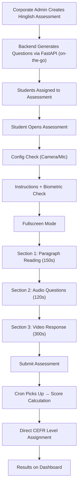

# Hinglish Communication Assessment

> The Hinglish Assessment evaluates a candidate's ability to communicate in **Hinglish** (Hindi-English code-mixed language) for **customer care roles**. It is a **one-time, non-progressive** assessment targeting Indian regional corporates.

---

## Overview

| Property | Value |
|---|---|
| **Assessment Type** | `Hinglish` |
| **CEFR Levels** | A1, A2, B1, B2, C1, C2 |
| **Domains** | Customer Care (default), or custom |
| **Scoring Engine** | FastAPI AI Engine (Gemini/Groq + Bolna.ai STT) |
| **Progression** | None — one-time assessment, direct CEFR mapping |
| **Question Generation** | On-the-go at assignment time (no cron) |
| **Target** | Corporate only (customer care hiring) |

---

## Assessment Sections (3 Types — No Writing)

| # | Section | Ability Tested | Scoring Method |
|---|---------|---------------|----------------|
| 1 | **Paragraph Reading** | Reading + Pronunciation | Bolna.ai STT transcription → pronunciation, fluency, completeness, prosody scoring |
| 2 | **Audio Question** | Listening Comprehension | MCQ-based (correct/total) |
| 3 | **Video Response** | Speaking | Bolna.ai transcription → AI evaluation (grammar flexibility, content relevance, fluency, vocabulary) |

**Not included:** Email Writing, Dictation, Sentence Completion, Sentence Build, Question Based Response — all writing sections are excluded.

---

## Final Score Weights

```
Final Score = (Video Response × 0.50)
            + (Paragraph Reading × 0.25)
            + (Audio Question × 0.25)
```

**Rationale:** Customer care roles prioritize speaking ability (50%), with equal weight to reading/pronunciation (25%) and listening comprehension (25%).

---

## CEFR Level Assignment (Direct Mapping)

Unlike Communication assessments which use rolling pairs and progression, Hinglish uses a **direct score-to-CEFR mapping**:

| Score Range | CEFR Level | Interpretation |
|-------------|-----------|----------------|
| 0–30 | A1 | Beginner — cannot handle customer calls |
| 31–50 | A2 | Elementary — basic greetings only |
| 51–65 | B1 | Intermediate — can handle simple queries |
| 66–80 | B2 | Upper Intermediate — handles most calls well |
| 81–90 | C1 | Advanced — excellent communication |
| 91–100 | C2 | Mastery — near-native fluency |

No progression pairs, no suggestedCefr carry-forward, no diagnosis assessments. One assessment → one CEFR level → done.

---

## End-to-End Flow



---

## Key Differences from Communication Assessment

| Aspect | Communication | Hinglish |
|--------|--------------|----------|
| Sections | 8 (R/L/S/W) | 3 (R/L/S only) |
| Progression | Rolling pairs, A1→C2 journey | None — one-time only |
| Questions | Pre-generated via cron, rotated | Generated on-the-go at assignment |
| Transcription | Azure Speech SDK | Bolna.ai (Hinglish support) |
| Score weights | Video 40%, Reading 20%, Audio 10%, Writing 30% | Video 50%, Reading 25%, Audio 25% |
| CEFR assignment | Pair averaging + progression rules | Direct score-to-level mapping |
| Practice mode | Yes | No |
| Entity type | Colleges + Corporates | Corporates only |
| Retakes | Yes with tracking | No (one-time) |
| ProgressionHistory | Yes (pair tracking) | No records created |

---

## File Reference

### 1. Assessment Creation (Admin)

#### Frontend — `AssessmentSelect.js`
**Path:** `admin-react/src/modules/Assessment/Partials/CreateAssessment/AssessmentSelect.js`

- Admin selects assessment type = `Hinglish`
- Configures: name, start/end date, CEFR level (default B1), domain (default Customer Care), proctoring
- Corporate-focused with college warning
- Dispatches `assignAssessment` with `assessmentType: "Hinglish"`

#### Backend — `Assessment.js` → `assignHinglishAssessment()`
**Path:** `admin-node/app/models/Assessment.js`

**Key steps:**
1. Fetches participants (same as Communication)
2. Gets "Hinglish" assessment type ID
3. Generates questions on-the-go via FastAPI `/hinglish/generate-questions`
4. Stores question set in DB (assessment_set with cefrLevel)
5. Creates assessmentInstituteMap/assessmentCorporateMap with `isOneTime = true`
6. Assigns students directly — no progression_history queries, no suggestedCefr lookup
7. All students get the admin-selected CEFR level

#### FastAPI Question Generation — `hinglish.py`
**Path:** `fastapi-ai-engine/routers/hinglish.py`

- Endpoint: `GET /hinglish/generate-questions?CEFR_level=B1&domain=Customer Care`
- Uses `HinglishQuestionGenerator` to create Hinglish-specific content
- Generates Paragraph Reading passages, Audio Question MCQs, and Video Response prompts
- All content in Hinglish (Hindi-English code-mixed)

---

### 2. Student-Facing Frontend

**Path:** `Assessment-React/src/modules/Assessments/Partials/Hinglishassmt/`

| File | Purpose |
|------|--------|
| `index.js` | Entry point — ConfigCheck (camera/mic), Start button |
| `instruction.js` | Instructions page — biometric check, fullscreen, 3-section explanation |
| `assessment.js` | Main assessment UI — renders 3 sections only, handles recording, timers, violation detection |
| `completion.js` | Thank-you page — submission confirmation |

**Section timers:**
- Paragraph Reading: 150 seconds
- Audio Question: 120 seconds
- Video Response: 300 seconds

---

### 3. Score Calculation

#### Orchestration — `HinglishCalculations.js`
**Path:** `student-node/app/models/HinglishCalculations.js`

| Function | What It Does |
|----------|-------------|
| `calculateParagraphReadingScore()` | Same as Communication — sends audio to FastAPI for speech analysis + MCQ |
| `calculateAudioQuestionScore()` | Same as Communication — pure MCQ scoring |
| `calculateVideoQuestionScore()` | Same as Communication — sends video to FastAPI for AI analysis |
| `calculateHinglishFinalScore()` | Weighted formula: Video 50% + Paragraph 25% + Audio 25% |
| `getHinglishCefrLevel()` | Direct score-to-CEFR mapping (no progression logic) |
| `storeHinglishScores()` | Stores scores in `communication_scores` table, updates `resulting_cefr` |

#### Dispatch — `Assessment.js` → `calculateAssessmentScore()`
**Path:** `student-node/app/models/Assessment.js`

When `assessmentType === "hinglish"`:
1. Reconstructs response (same as Communication)
2. Calculates 3 section scores
3. Stores via `storeHinglishScores()`
4. **No CEFR progression** — no `updateCurrCERFlevelOfStudent` call
5. CEFR stored directly on `assessmentAssignedStudent.resultingCefr`

---

### 4. Dashboard & Reporting

#### Institute Dashboard
**Path:** `institute-react/src/modules/Assessment/`

- Hinglish treated like Communication in dashboards (same student list API, same CEFR charts)
- Shows 3 ability scores: Reading, Listening, Speaking (no Writing column)
- CEFR level filters work identically to Communication
- Uses `fetchSpecificAssessmentStudentList` API (shared with Communication)

#### Report API
**Path:** `student-node/app/handlers/assessmentHandler.js` → `getHinglishAssessmentReport`

Returns:
- Final score (0-100)
- CEFR level (A1-C2)
- Section scores (Paragraph Reading, Audio Question, Video Response)
- Ability breakdown (Reading, Listening, Speaking)

---

## Database

Uses the **same tables** as Communication — no new tables created:

| Table | Usage for Hinglish |
|-------|-------------------|
| `assessment_type` | New row: `type_name = 'Hinglish'` |
| `sections` | 3 rows linked to Hinglish type: Paragraph Reading, Audio Question, Video Response |
| `assessment_domain` | New row: `type_name = 'Customer Care'` (if not exists) |
| `assessment_set` | Stores generated question sets with CEFR level |
| `assessment_institute_map` / `assessment_corporate_map` | Links assessment to entity, `is_one_time = true` |
| `assessment_assigned_students` | Per-student assignment with `resulting_cefr` |
| `communication_scores` | Section scores (reused table) |
| `student_answers` | Raw student responses |

**Not used:** `progression_history` — no records created for Hinglish assessments.

---

## DB Migration

**Path:** `student-node/prisma/migrations/hinglish_assessment_seed.sql`

Seeds the Hinglish assessment type, 3 sections, and Customer Care domain.
